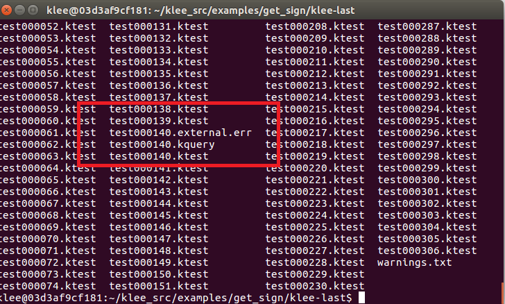
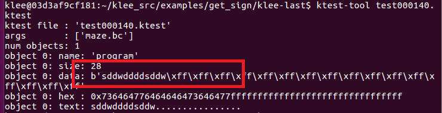

# 作业：安装KLEE，完成官方tutorials。至少完成前三个，有时间的同学可以完成全部一共7个。

## 安装KLEE

```bash
#使用docker安装KLEE
$sudo apt install docker
$sudo apt install docker.io
$docker pull klee/klee

$ git clone https://github.com/klee/klee.git
$ cd klee
$ docker build -t klee/klee .
//创建一个klee的docker容器
$ docker run --rm -ti --ulimit='stack=-1:-1' klee/klee
```


## 完成tutorials

1.[First tutorial](http://klee.github.io/tutorials/testing-function/): Testing a small function.

```c++
//这是一个判断正负数的程序
#include <klee/klee.h>

int get_sign(int x) {
  if (x == 0)
     return 0;
  
  if (x < 0)
     return -1;
  else 
     return 1;
} 

int main() {
  int a;
  klee_make_symbolic(&a, sizeof(a), "a");
  //klee_make_symbolic：KLEE工具自带的测试函数，通过自定义的变量，不断产生值赋给a，以此完成自动生成样例功能
  return get_sign(a);
} 
```

* 编译该文件

```bash
clang -I ../../include -emit-llvm -c -g get_sign.c
```

* 运行klee

```bash
klee get_sign.bc
```

* 可以看到输出结果


* 列出当前目录所有文件，klee-out-0是本次测试结果，klee-last是最新测试结果，每次测试后覆盖。 


* 编写一个有软件缺陷的程序

```c++
#include<stdio.h>
#include<stdlib.h>

void kleeTest(int a){
	int arr[10];
	int d[10];

	for (int i = 0; i < 10; i++){ //赋初始值
		arr[i] = i;
	}

	if (a < -50){  //求余分母为0
		for (int i = 0; i < 10; i++){
			int num = i;
			d[i] = arr[i] % num;
		}
	}
	else if(a < -25){  //除法分母为0
		for (int i = 0; i <= 10; i++){
			int num = i ;
			d[i] = arr[i] / num;
		}
	}
	else if (a < 0){  //数组越界
		for(int i = 0; i<= 11; i++){
			arr[i] = i;
		}
	}
	else if (a < 25){  //空指针
		int *a = NULL;
		int b = *a + 1;
	}
	else if(a < 50){  //内存泄漏
		free(arr);
	}
}

int main(){
	int n;
	klee_make_symbolic(&n, sizeof(n), "n");
	kleeTest(n);
	return 0;
}
```

* 使用如下命令将文件传入docker容器

```bash
#找到容器名称
docker ps -a
#找到id全称
docker inspect -f '{{.Id}}' thirsty_zhukovsky
#传到docker物理机所在位置
docker cp maze.c 03d3af9cf181ebb92128d01e47632cf87ed98971accfae24c9f53fe4a8002b02:/home/klee/klee_src/examples/get_sign/
```


* 先编译，`clang -I ../../include -emit-llvm -c -g mytest.c`，再利用`klee mytest.bc`测试，查看报错可在.err文件中查看具体漏洞，分别为数组越界，空指针，除数为0等错误


2.Second tutorial](http://klee.github.io/tutorials/testing-regex/): Testing a simple regular expression library.

> 这个例子中的错误不是由于正则表达式函数的错误，而是我们测试驱动程序的错误。由于我们的符号变量re是一个字符数组，但是match函数期望它是一个以null终止的字符串，所以会报错。

```c++
#include <klee/klee.h>
static int matchhere(char*,char*);
static int matchstar(int c, char *re, char *text) {
  do {
    if (matchhere(re, text))
      return 1;
  } while (*text != '\0' && (*text++ == c || c== '.'));
  return 0;
}

static int matchhere(char *re, char *text) {
  if (re[0] == '\0')
     return 0;
  if (re[1] == '*')
    return matchstar(re[0], re+2, text);
  if (re[0] == '$' && re[1]=='\0')
    return *text == '\0';
  if (*text!='\0' && (re[0]=='.' || re[0]==*text))
    return matchhere(re+1, text+1);
  return 0;
}

int match(char *re, char *text) {
  if (re[0] == '^')
    return matchhere(re+1, text);
  do {
    if (matchhere(re, text))
      return 1;
  } while (*text++ != '\0');
  return 0;
}

/*
 * Harness for testing with KLEE.
 */

// The size of the buffer to test with.
#define SIZE 7

int main() {
  // The input regular expression.
  char re[SIZE];
  
  // Make the input symbolic. 
  klee_make_symbolic(re, sizeof re, "re");

  // Try to match against a constant string "hello".
  match(re, "hello");

  return 0;
}

```

* KLEE运行测试后报错，说明出现内存错误，指针超出了预定范围

```bash
Error: memory error: out of bound pointer
```


* 解决此问题的最简单方法是在将符号设为符号后，将'\ 0'存储在缓冲区的末尾

```c++
int main() {
  // The input regular expression.
  char re[SIZE];

  // Make the input symbolic.
  klee_make_symbolic(re, sizeof re, "re");
  re[SIZE - 1] = '\0';

  // Try to match against a constant string "hello".
  match(re, "hello");

  return 0;
}
```

3.[Solving a maze with KLEE](http://feliam.wordpress.com/2010/10/07/the-symbolic-maze/): A nice explanation of how symbolic execution can be used to generate interesting program inputs. The example shows how to use KLEE to find all the solutions to a maze game.

> 这是一个11*7的迷宫问题，程序中故意在迷宫的第二行设置了一道假墙。KLEE通过符号执行找到了所有的解（包括陷阱）。
> 通过这个例子可以完全看到KLEE符号执行的过程，首先是按照符号变量的size每一个字节都是符号值，然后从第一个字节开始一个一个地试验具体值（本例中实验的顺序w->a->d->s,并依次逐个尝试，然后保存所有可行的具体值，再此基础上在再试验第二个字节，如此下去，直到实验完所有的字节，也就找到了所有的可行路径。）

* 修改测试代码，将read调用改成klee_make_symbolic，这样就符号化了program变量，这样之后KLEE就会找出所有的路径，但是这样是不够的，因为我们只对win的路径感兴趣， 所以需要由一个flag来表示。我们可以在`printf ("You win!\n");`这个语句之后增加一个`klee_assert(0);`，这样只要找到一个成功的路径，就会触发一个assert

```c++
#include<string.h>
#include<stdio.h>
#include<stdlib.h>
#define H 7
#define W 11
/**
* Tha maze map
*/
char maze[H][W] = { "+-+---+---+",
					"| |     |#|",
					"| | --+ | |",
					"| |   | | |",
					"| +-- | | |",
					"|     |   |",
					"+-----+---+" };

/**
* Draw the maze state in the screen!
*/
void draw ()
{
		int i, j;
		for (i = 0; i < H; i++)
		{
				for (j = 0; j < W; j++)
								printf ("%c", maze[i][j]);
				printf ("\n");
		}
		printf ("\n");
}


/**
* The main function
*/
int main (int argc, char *argv[])
{
		int x, y;     //Player position
		int ox, oy;   //Old player position
		int i = 0;    //Iteration number
	#define ITERS 28
	char program[ITERS];

//Initial position
		x = 1;
		y = 1;
	maze[y][x]='X';

//Print some info
	printf ("Maze dimensions: %dx%d\n", W, H);
	printf ("Player pos: %dx%d\n", x, y);
	printf ("Iteration no. %d\n",i);
	printf ("Program the player moves with a sequence of 'w', 's', 'a' and 'd'\n");
	printf ("Try to reach the price(#)!\n");

//Draw the maze
	draw ();    
//Read the directions 'program' to execute...
//read(0,program,ITERS);
    klee_make_symbolic(program,ITERS,"program");
//Iterate and run 'program'
		while(i < ITERS)
		{
		//Save old player position
				ox = x;
				oy = y;
		//Move polayer position depending on the actual command
				switch (program[i])
					{
					case 'w':
							y--;
							break;
					case 's':
							y++;
							break;
					case 'a':
							x--;
							break;
					case 'd':
							x++;
							break;
					default:
						printf("Wrong command!(only w,s,a,d accepted!)\n");
						printf("You loose!\n");
						exit(-1);
					}

		//If hit the price, You Win!!            
				if (maze[y][x] == '#')
					{
							printf ("You win!\n");
                    		  klee_assert(0);
							printf ("Your solution <%42s>\n",program);
							exit (1);
					}
		//If something is wrong do not advance
				if (maze[y][x] != ' '
					&&
					!((y == 2 && maze[y][x] == '|' && x > 0 && x < W)))
					{
							x = ox;
							y = oy;
					}
		
		//Print new maze state and info...
		printf ("Player pos: %dx%d\n", x, y);
		printf ("Iteration no. %d. Action: %c. %s\n",i,program[i], ((ox==x && oy==y)?"Blocked!":""));
		
		//If crashed to a wall! Exit, you loose
		if (ox==x && oy==y){
					printf("You loose\n");
				exit(-2);
		}
		//put the player on the maze...
		maze[y][x]='X';
		//draw it
				draw ();
		//increment iteration
				i++;
				//me wait to human
				sleep(1);
		}
//You couldn't make it! You loose!       
printf("You loose\n");
}
```

* 编译maze.c文件，运行KLEE，得到测试结果

```bash
llvm-gcc -c klee –emit-llvm maze_klee.c -o maze_klee.bc
klee maze.bc
```


* 重新测试第140个报错的实例，发现结果为**sddwddddsddw**，测试通过，可以得出结论：在迷宫的第二行开了“fake wall”

```bash
ktest-tool test000140.ktest
```





* 这个测试实例一共有四个结果

```bash
#使用此命令输出错误状态下的路径
klee –emit-all-errors maze_klee.o
#重新得到结果为
1. ssssddddwwaawwddddssssddwwww
2. ssssddddwwaawwddddsddw
3. sddwddddssssddwwww
4. sddwddddsddw
```

