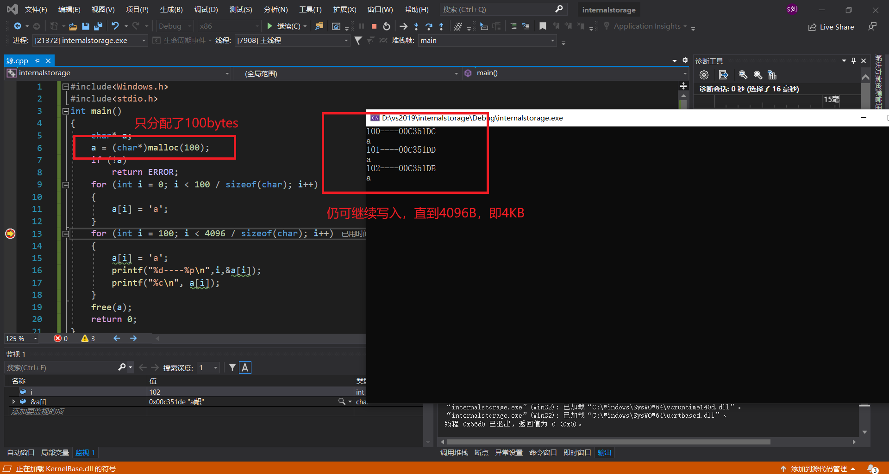
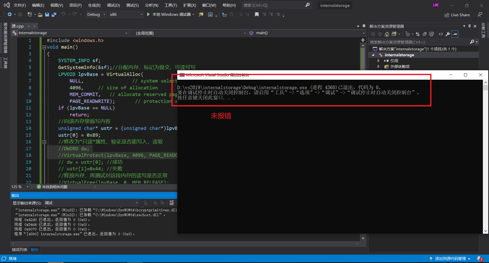

# 作业：

## 1、阅读VirtualAlloc、VirtualFree、VirtualProtect等函数的官方文档。

[VirtualAlloc function](https://docs.microsoft.com/en-us/windows/win32/api/memoryapi/nf-memoryapi-virtualalloc)

[VirtualFree function](https://docs.microsoft.com/en-us/windows/win32/api/memoryapi/nf-memoryapi-virtualfree)

[VirtualProtect function](https://docs.microsoft.com/en-us/windows/win32/api/memoryapi/nf-memoryapi-virtualprotect)

## 2、编程使用malloc分配一段内存，测试是否这段内存所在的整个4KB都可以写入读取。

```c++
#include<Windows.h>
#include<stdio.h>
int main()
{
	char* a;
	a = (char*)malloc(100);
	if (!a)
		return ERROR;
	for (int i = 0; i < 100 / sizeof(char); i++)
	{
		a[i] = 'a';
	}
	for (int i = 100; i < 4096 / sizeof(char); i++)
	{
		a[i] = 'a';
		printf("%d----%p\n",i,&a[i]);
		printf("%c\n", a[i]);
	}
	free(a);
	return 0;
}
```

### 测试截图如下

* 此处vs2019虽提示超出有效范围0~99，但忽视该错误，选择继续时仍然可以写入



## 3、使用VirtualAlloc分配一段，可读可写的内存，写入内存，然后将这段内存改为只读，再读数据和写数据，看是否会有异常情况。然后VirtualFree这段内存，再测试对这段内存的读写是否正常。

```c++
#include <windows.h>
void main()
{ 
    SYSTEM_INFO sf;  
    GetSystemInfo(&sf);//分配内存，标记为提交、可读可写 
    LPVOID lpvBase = VirtualAlloc( 
        NULL,                 // system selects address        
        4096,     // size of allocation        
        MEM_COMMIT,   // allocate reserved pages        
        PAGE_READWRITE);       // protection = no access   
    if (lpvBase == NULL )   
        return;
    //向该内存里面写内容
    unsigned char *ustr=(unsigned char *)lpvBase; 
    ustr[0]=0x89;
    //修改为“只读”属性，验证是否能写入，读取
    DWORD dw; 
    VirtualProtect(lpvBase,4096,PAGE_READONLY,&dw);
    // dw = ustr[0]; //成功
    // ustr[1]=0x44; //失败
    //释放内存，再测试对这段内存的读写是否正常
    VirtualFree(lpvBase,0,MEM_RELEASE);
    ustr[0]=0x56;
    dw = ustr[0];
    return;
} 

```

### 测试截图如下

* 可读可写写入成功



* 只读写入失败，读取成功


* VirtualFree后，测试读写均失败


## 总结

* 系统确实以4KB作为单元在管理内存，要么4KB全部有效，要么全部无效；每个4KB的内存分页，其实有三个属性，可读可写可执行
* 当权限为可读可写时，读写操作均可进行；当权限为只读时，写操作会引发错误；当内存被free掉时，无法再对该段内存进行任何操作