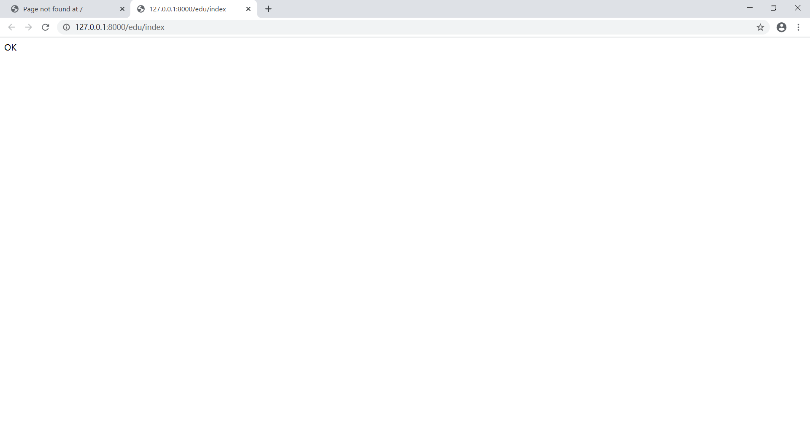

# 缓冲区溢出漏洞实验报告

## 实验原理

> 缓冲区溢出的根本原因是冯洛伊曼体系的计算机并不严格的区分代码段和数据段，只是简单的根据eip的指向来决定哪些是代码，所以缓冲区溢出攻击都会通过某种方式修改eip的值，让其指向恶意代码。缓冲区溢出攻击一般分为堆缓冲区溢出攻击和栈缓冲区溢出攻击
>
> 当然，随便往缓冲区中填东西造成它溢出一般只会出现“分段错误”（Segmentation fault），而不能达到攻击的目的。最常见的手段是通过制造缓冲区溢出使程序运行一个用户shell，再通过shell执行其它命令。如果该程序属于root且有suid(Set User ID,)权限的话，攻击者就获得了一个有root权限的shell，可以对系统进行任意操作了。

## 实验过程

此实验根据strcpy（）函数使用时，程序员没有预料到需要多少的输出缓冲区来处理输入缓冲区从而导致的缓冲区溢出，如下图中只是简单将命令参数复制，而预留y仅有10空间

```c
int main(int argc,char**argv)
//argc 是 argument count的缩写，表示传入main函数的参数个数；
//argv 是 argument vector的缩写，表示传入main函数的参数序列或指针，并且第一个参数argv[0]一定是程序的名称，并且包含了程序所在的完整路径，所以确切的说需要我们输入的main函数的参数个数应该是argc-1个；
{
	char y[10];
    if(argc>1)
    {
        strcpy(y,argv[1]);
    }
}
```

测试代码：

```c++
#define _CRT_SECURE_NO_WARNINGS

#include <stdlib.h>
#include <stdio.h>
#include <string.h>

int sub(char* x)
{
	char y[10];
	strcpy(y, x);
	return 0;
}

int main(int argc, char** argv)
{
	if (argc > 1)
		sub(argv[1]);
	printf("exit");
}
```

* 首先修改vscode有关参数取消安全检查以运行该程序，其中传入参数argv溢出部分决定了后续运行地址


* 在代码第十行设置断点，右键转到反汇编（注意修改->显示代码字节，删掉显示符号名）


* 调试->窗口，打开寄存器和内存，找到eip，eax所在地址，在内存中输入找到该地址存储信息

> **eax一般用来保存函数的返回值，esp是栈顶指针寄存器，ebp是栈底指针寄存器，eip寄存器，用来存储CPU要读取指令的地址，CPU通过eip寄存器读取即将要执行的指令。每次CPU执行完相应的汇编指令之后，eip寄存器的值就会增加。**

https://blog.csdn.net/zhu2695/article/details/16813425 （**EAX、EBX、ECX、EDX、ESI、EDI、ESP、EBP 寄存器详解**）

（F10逐过程运行，一次运行一条语句，但是遇到子函数调用时，不进入，直到子函数完成后，直接继续，即F10不进入方法体，F11进入方法体；F11是逐语句，当遇到子函数调用时，会进入子函数进行单步调试）


```
00D9195B E8 E9 F8 FF FF       call        00D91249//转到strcpy代码运行
```

* 当程序运行完strcpy（）函数返回时，弹出ret里返回地址，ebp赋值给eip


* 而CPU继续执行eip所指向的命令，该地址为无效地址，引发静态缓冲区溢出


* 此时如果分配地址不足，就会产生缓冲区溢出问题，通过改变输入可控制哪个地址执行下一条命令；此地址非程序员输入，为客户（黑客）输入，则调用内存中指定地址黑客希望执行的代码


### 漏洞利用

```c++
#define _CRT_SECURE_NO_WARNINGS

#include <stdlib.h>
#include <stdio.h>
#include <string.h>
int hacked()
{
	printf("hacked!!");
}
int sub(char* x)
{
	char y[10];
	strcpy(y, x);
	return 0;
}

int main(int argc, char** argv)
{
	if (argc > 1)
		sub(argv[1]);
	printf("exit");
}
```

* 程序中未调用hacked（）函数

首先找到eip崩溃时指向位置，修改命令参数，运行代码，找到错误代码时eip的值


根据异常时的位置修改命令参数中对应位置


让程序断点固定为基址


设置断点在main（）函数，在地址（A）中搜索可找到hacked（）程序所在位置



后尝试直接输入命令参数

* 找到内存中push函数所在位置（输出字符串）


* 由于在内存中位置为相反，所以21311613应为\x13\x16\x31\x21


成功执行指定模块代码


## 实验分析与总结

在使用strcpy（）函数时，由于输入命令参数argv大于预留缓冲区长度10，而strcpy（）函数直接复制到栈内，超过了预留栈空间，则溢出部分向堆栈底部方向继续写入数字“999999999”，“9”的ASCII码值为57，转化为二进制为00111001，转为十六进制为“39”，所以内存中ebp位置被数字"39393939"覆盖，则main（）函数返回时，将"39393939"视为返回地址，CPU试图执行此地址指令，发现为无效地址，则引发报错。

而由于输入由用户决定，若用户为黑客，将溢出部分数字改写为所需内存地址并调用该地址的函数，则可在用户电脑上进行操作。