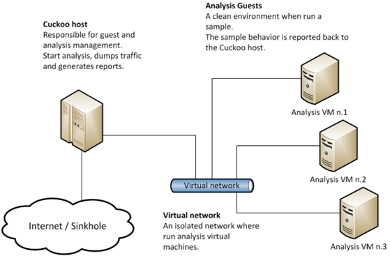
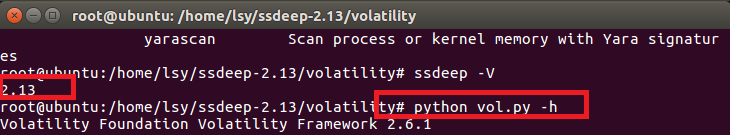
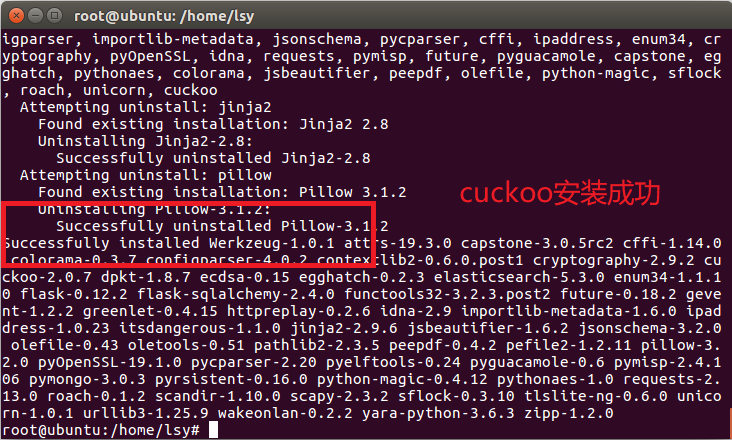
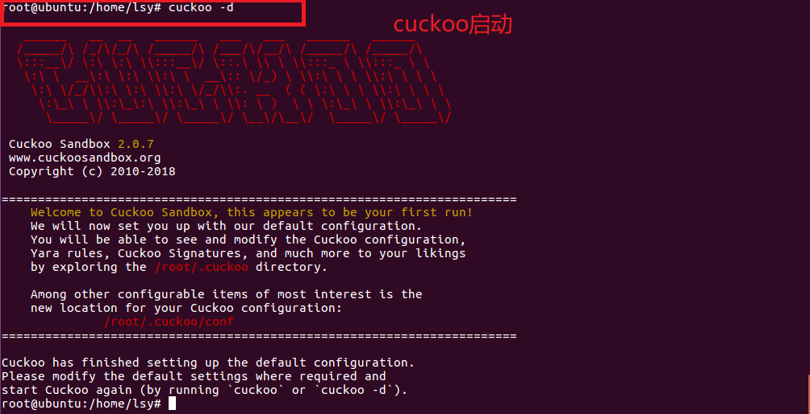
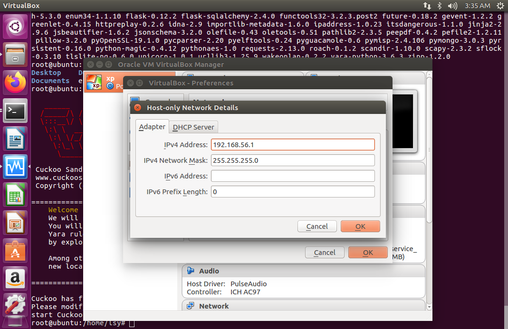
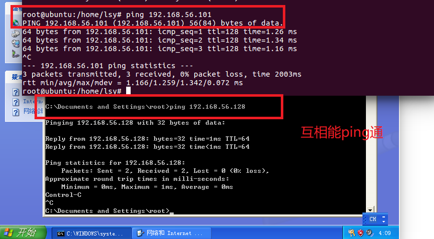
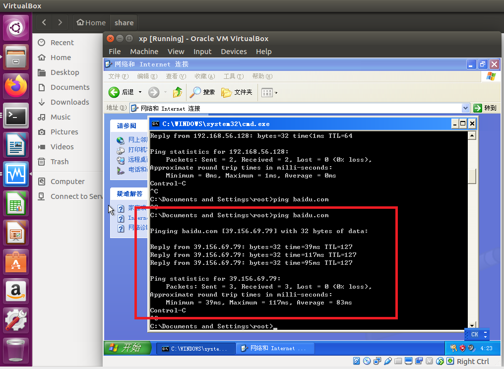
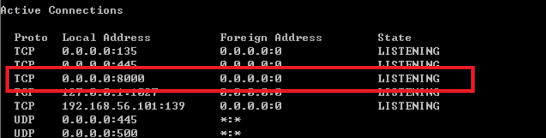
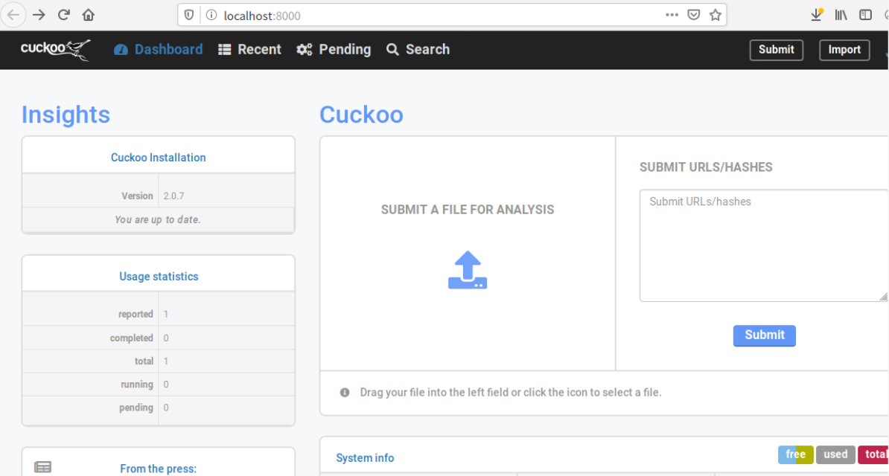
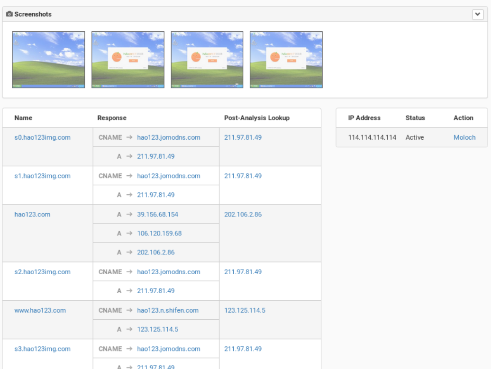

# 任意找一个程序，在cuckoo中trace获取软件行为的基本数据。

## 实验环境

* Ubuntu16.04server（host）
* windows xp（guest）

## 实验过程

### 环境搭建

> Cuckoo 的架构比较简单，在 Host 机上运行 Cuckoo 主程序，多个 Guest 机通过虚拟网络与 Host 机相连，每个 Guest 机上有一个 Cuckoo Agent 程序，用来做 Cuckoo 的监控代理，结构图如下
>
> 

#### ubuntu环境搭建

```bash
#更换源
sudo gedit /etc/apt/sources.list

deb http://mirrors.aliyun.com/ubuntu/ disco main restricted universe multiverse
deb-src http://mirrors.aliyun.com/ubuntu/ disco main restricted universe multiverse
deb http://mirrors.aliyun.com/ubuntu/ disco-security main restricted universe multiverse
deb-src http://mirrors.aliyun.com/ubuntu/ disco-security main restricted universe multiverse
deb http://mirrors.aliyun.com/ubuntu/ disco-updates main restricted universe multiverse
deb-src http://mirrors.aliyun.com/ubuntu/ disco-updates main restricted universe multiverse
deb http://mirrors.aliyun.com/ubuntu/ disco-backports main restricted universe multiverse
deb-src http://mirrors.aliyun.com/ubuntu/ disco-backports main restricted universe multiverse
deb http://mirrors.aliyun.com/ubuntu/ disco-proposed main restricted universe multiverse
deb-src http://mirrors.aliyun.com/ubuntu/ disco-proposed main restricted universe multiverse
#清除缓存
sudo rm -vfr /var/lib/apt/lists/*
#更新
sudo apt-get update
sudo apt-get upgrade
#安装cuckoo的依赖
sudo apt-get install git mongodb libffi-dev build-essential python-django python python-dev python-pip python-pil python-sqlalchemy python-bson python-dpkt python-jinja2 python-magic python-pymongo python-gridfs python-libvirt python-bottle python-pefile python-chardet tcpdump -y
#安装Tcpdump并确认安装无误
sudo setcap cap_net_raw,cap_net_admin=eip /usr/sbin/tcpdump
getcap /usr/sbin/tcpdump
#安装Pydeep
wget http://sourceforge.net/projects/ssdeep/files/ssdeep-2.13/ssdeep-2.13.tar.gz/download -O ssdeep-2.13.tar.gz
tar -zxf ssdeep-2.13.tar.gz
cd ssdeep-2.13
./configure
make
sudo make install
#确认pydeep安装无误
#检查版本
ssdeep -V 
#再安装一次看看会不会提示已安装
pip show pydeep  
#安装Volatility
sudo pip install openpyxl ujson pycrypto distorm3 pytz
git clone https://github.com/volatilityfoundation/volatility.git
cd volatility
python setup.py build
python setup.py install
#确认安装无误
python vol.py -h
#安装Cuckoo
sudo apt-get install libtiff5-dev libjpeg8-dev zlib1g-dev libfreetype6-dev liblcms2-dev libwebp-dev tcl8.6-dev tk8.6-dev python-tk
pip install -U cuckoo
cd /home/(username)/.local/bin/ 
python cuckoo
cd /home
cuckoo -d
```

* 确保安装成功



* 此时由于没有配置cuckoo，cuckoo无法连接套接字报错，但cuckoo已安装成功





#### windows xp环境搭建

```bash
#在虚拟机中安装虚拟机
sudo apt-get install virtualbox
#安装windows xp
ed2k://|file|zh-hans_windows_xp_professional_with_service_pack_3_x86_cd_x14-80404.iso|630239232|CD0900AFA058ACB6345761969CBCBFF4|/
```

##### 基本网络配置

* 仅主机（Host-Only）网络
* 点击virtualbox的管理→主机网络管理器→创建，这样会自动创建一个ip地址为192.168.56.1的名为vboxnet0的网卡，这里不用开启DHCP服务器，因为后面我们要手动配置XP虚拟机的IP地址
* Ubuntu主机，手动设置IP
* 尝试双方是否能ping通





### 配置IP转发

host（Ubuntu）中设置

```bash
#开启ip转发
sudo -i
sysctl -w net.ipv4.ip_forward=1
echo 1 > /proc/sys/net/ipv4/ip_forward
#为使重启之后仍然有效
gedit /etc/sysctl.conf
去掉net.ipv4.ip_forward=1 前的#号，保存
sysctl -p /etc/sysctl.conf
#配置Iptables的规则
#首先需要删除所有的防火墙配置，再执行以下步骤
iptables -A FORWARD -o eth0 -i vboxnet0 -s 192.168.56.0/24 -m conntrack --ctstate NEW -j ACCEPT
iptables -A FORWARD -m conntrack --ctstate ESTABLISHED,RELATED -j ACCEPT
iptables -A POSTROUTING -t nat -j MASQUERADE
#接着为保证重启之后依然有效
sudo gedit /etc/network/interfaces
#在最后添加两行
pre-up iptables-restore < /etc/iptables.rules 
post-down iptables-save > /etc/iptables.rules
```

* 此时Ubuntu无法ping通而xp虚拟机可以ping通



### 启动客户机的agent

```bash
#下载python2.7安装包和PIL安装包
wget https://www.python.org/ftp/python/2.7.13/python-2.7.13.msi
wget http://effbot.org/media/downloads/PIL-1.1.7.win32-py2.7.exe
```

* 在home下新建一个文件夹share，将文件.cuckoo/agent/agent.py复制到share，把 agent.py 后缀改成 agent.pyw
  ，将agent.pyw复制到C:\Python27\文件夹下，双击运行；打开cmd，输入`netstat -an`，查看本地8000端口是否在监听（如果8000端口正在监听，那说明此xp虚拟机就能被cuckoo所调用）



* 在8000端口正在被监听的状态下，在virtualbox保存xp虚拟机快照，将快照命名为snapshot1

### 配置cuckoo

**cuckoo.conf**

```bash
machinery = virtualbox
[resultserver]
ip = 192.168.56.1 #This is the IP address of the host
port = 2042 #leave default unless you have services running
```

**auxiliary.conf**

```bash
[sniffer]
# Enable or disable the use of an external sniffer (tcpdump) [yes/no].
enabled = yes
# Specify the path to your local installation of tcpdump. Make sure this
# path is correct.
tcpdump = /usr/sbin/tcpdump
```

**virtualbox.conf**

```bash
machines = 你的虚拟机名字
[你的虚拟机名字]
label = 你的虚拟机名字
platform = windows
ip = 192.168.56.101 # IP address of the guest
snapshot = 你创建的快照名字
interface = vboxnet0
```

**reporting.conf**

```bash
[mongodb]
enabled = yes
```

### cuckoo使用

```bash
#首先运行以下指令，解决tcpdump的权限被拒绝
sudo apt-get install apparmor-utils
sudo aa-disable /usr/sbin/tcpdump
```

* 打开`.cuckoo/analyzer/windows/modules/auxiliary/recentfiles.py`将使用SHGetKnownFolderPath函数的部分注释掉（python中可以以三个单引号作为注释，且要注意三个单引号要与 r= 对齐，因为python中是以缩进来划分代码块）

```python
 '''
     r = SHELL32.SHGetKnownFolderPath(
         uuid.UUID(self.locations[location]).get_bytes_le(),
         0, None, ctypes.byref(dirpath)
     )
     if r:
         log.warning("Error obtaining user directory: 0x%08x", r)
         return
     # TODO We should free the memory with CoTaskMemFree().
     return dirpath.value
     '''
```

* 接着打开两个终端，一个**先**输入`cuckoo -d`，另一个**再**输入`cuckoo web runserver`，接着用浏览器打开`127.0.0.1:8000`登录到cuckoo的web服务页面，点击上传按钮可以提交样本，点击提交，主机会将客户机恢复快照，并将样本传送至客户机进行运行分析，此处用到[病毒样本-EXE样本5X_33](https://bbs.kafan.cn/thread-2145532-1-1.html) 的exe文件



* 如图，它尝试连接了许多连接，并且下载了橙子浏览器的安装程序并自动运行，点击进入分析日志会发现没有报错，结果页面可显示测试后样本的行为，展示样本的基本信息，样本运行的基本信息，样本运行时的屏幕截图



