# 作业：

>搜集市面上主要的路由器厂家、在厂家的官网中寻找可下载的固件在CVE漏洞数据中查找主要的家用路由器厂家的已经公开的漏洞，选择一两个能下载到切有已经公开漏洞的固件。如果能下载对应版本的固件，在QEMU中模拟运行。确定攻击面（对哪个端口那个协议进行Fuzzing测试），尽可能多的抓取攻击面正常的数据包（wireshark）。查阅BooFuzz的文档，编写这对这个攻击面，这个协议的脚本，进行Fuzzing。配置BooFuzz QEMU的崩溃异常检测，争取触发一次固件崩溃，获得崩溃相关的输入测试样本和日志。尝试使用调试器和IDA-pro监视目标程序的崩溃过程，分析原理。

## 实验环境

* [Ubuntu 18.04.4 Desktop (64-bit)](http://releases.ubuntu.com/18.04/ubuntu-18.04.4-desktop-amd64.iso.torrent?_ga=2.84584848.808955035.1588748362-1938635844.1588748362)
* qemu-4.0.0

## 实验过程

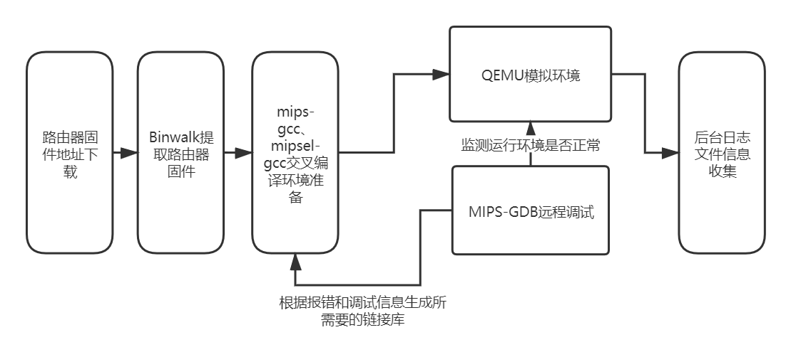

### 主流家用路由器漏洞

* 漏洞名：DIR-859_REVA_FIRMWARE_v1.05B03
* 下载地址：[ftp://ftp2.dlink.com/PRODUCTS/DIR-859/DIR-859_REVA_FIRMWARE_v1.05B03.zip](ftp://ftp2.dlink.com/PRODUCTS/DIR-859/DIR-859_REVA_FIRMWARE_v1.05B03.zip)

### 环境配置

* 从https://people.debian.org/~aurel32/qemu/mips/下载debianmips qemu镜像，由于虚拟机是Ubuntu linux，下载debian_squeeze_mips_standard.qcow2和vmlinux-2.6.32-5-4kc-malta

```
apt-get install zlib1g-dev
apt-get install libglib2.0-0
apt-get install libglib2.0-dev
apt-get install libtool
apt-get install libsdll.2-dev
apt-get install libpixman-1-dev
apt-get install autoconf
apt-get install qemu
apt-get install qemu-user-static
apt-get install qemu-system
```

* MIPS系统网络配置

```python
#获取安装依赖
sudo apt-get install bridge-utils uml-utilities
#修改ubuntu主机网络配置，将ubuntu的网络接口配置文件 /etc/network/interfaces 修改为如下内容并保存、关闭
sudo gedit /etc/network/interfaces
#在后面加上
#auto br0
iface br0 inet dhcp
    bridge_ports ens33
    bridge_maxwait 0
#修改QEMU的网络接口启动脚本，重启网络使配置生效
sudo gedit /etc/qemu-ifup
#在后面加上
#!/bin/sh
echo "EXECUTING /etc/qemu-ifup"
echo "Bringing $1 for bridged mode..."
sudo /sbin/ifconfig $1 0.0.0.0 promisc up
echo "Adding $1 to br0..."
sudo /sbin/brctl addif br0 $1
sleep 3
#保存文件/etc/qemu-ifup 以后，赋予可执行权限，然后重启网络使所有的配置生效
sudo chmod a+x /etc/qemu-ifup
sudo /etc/init.d/networking restart
```

* QEMU启动配置

```python
sudo ifdown ens33#先启动桥接网络
sudo ifup br0#
sudo qemu-system-mips -M malta -kernelvmlinux-2.6.32-5-4kc-malta -hda debian_squeeze_mips_standard.qcow2 -append"root=/dev/sda1 console=tty0" -net nic,macaddr=00:16:3e:00:00:01 -nettap#进入前面下载的mips镜像目录，输入root/root便可登入qemu mips虚拟机
```

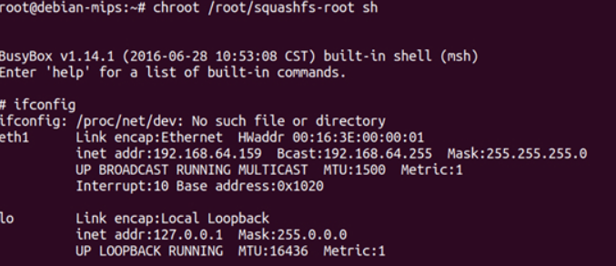

* 可使用ssh连接Ubuntu主机与mips虚拟机

### 漏洞固件模拟运行

* 使用binwalk直接解压固件可得到文件系统文件

```
binwalk firmware.bin
```

* 使用scp命令将squashfs-root目录上传到qemu mips虚拟机

```python
scp -r 文件夹名 root@ip:文件夹名
chroot /root/squashfs-root sh #运行
```

* Ubuntu中打开浏览器，输入192.168.0.1即可访问仿真路由器：

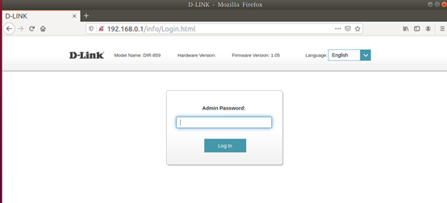

### 练习使用boofuzz进行分析

* 根据burpsuite抓包数据编写fuzz脚本

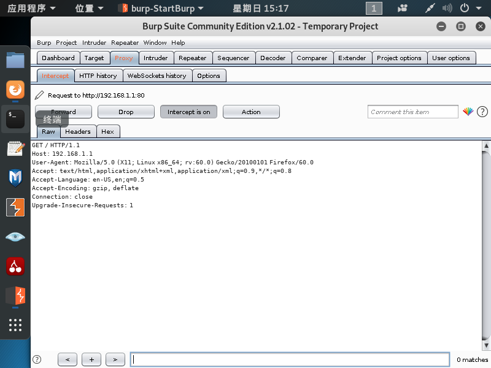

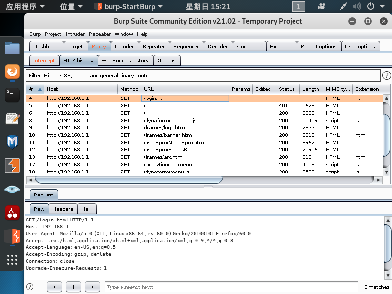

```python
#!/usr/bin/env python
# Designed for use with boofuzz v0.0.9
# coding=utf-8
from boofuzz import *
#设置会话信息，包括设备的IP地址以及端口
def main():
    session = Session(
        target=Target(
            connection=SocketConnection("192.168.1.1", 80, proto='tcp')
        ),
    )
#根据API接口的数据包构造请求，利用boofuzz框架提供的原语对http请求进行定义
    s_initialize(name="Request")
    with s_block("Request-Line"):
        # LINE 1
        s_static("POST", name="Method")
        s_delim(" ", name='space-1')
        s_string("/fromLogin", name='Request-URI')  # variation
        s_delim(" ", name='space-2')
        s_static('HTTP/1.1', name='HTTP-Version')   
        s_static("\r\n")

        # LINE 2
        s_static("Host", name="Host")
        s_static(": ")
        s_static("192.168.1.1", name="ip")
        s_static("\r\n")

        # LINE 3  对应 Content-Length: 400
        s_static('Content-Length')
        s_static(': ')
        s_size('data', output_format='ascii', fuzzable=True)    
        # size的值根据data部分的长度自动进行计算，同时对该字段进行fuzz
        s_static('\r\n')

        s_static('\r\n')

    # 对应http请求数据
    with s_block('data'):
        s_static('login_name=&curTime=1581845487827&setLang=&setNoAutoLang=&login_n=admin&login_pass=')
        s_string('123456', max_len=1024)
        s_static('&languageSel=1')

    session.connect(s_get("Request"))

    session.fuzz()


if __name__ == "__main__":
    main()

```

### 结果分析

#### 使用工具

* Ghidra
* DB Browser for SQLite

#### 漏洞原理

* 调用`session.fuzz()`驱动整个过程，然后运行脚本查看漏洞分析

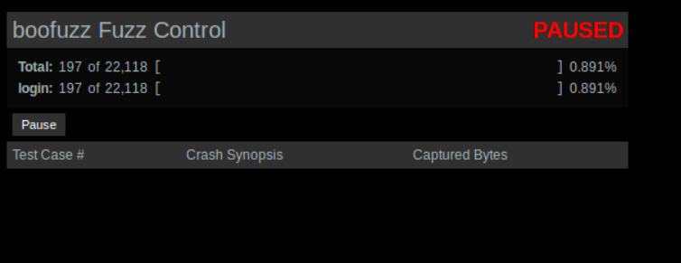

* 从伪码中可以看到，`sprintf()`函数设置了一个包含所有值的缓冲区，其中函数参数 `service=`及其值，被`xmldbc_ephp()`函数(最后调用send())将“buffer_8”中包含的数据发送给PHP，可看出`sprintf()`用于连接多个变量的值，用于填充一个缓冲区，设置要传递的新变量，其中SHELL_FILE将以格式`%s_%d.sh`进行传递，主要用于为新的shell脚本命名。缓冲区中的数据经过`xmldbc_ephp()`处理后，由PHP文件run.NOTIFY.php进行处理

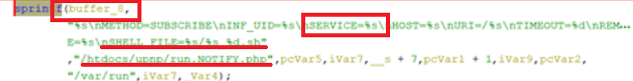

* 程序的调用流程为：`buffer_8 ->xmldbc_ephp->FUN_0041420c ->FUN_0041372c -> socket`。

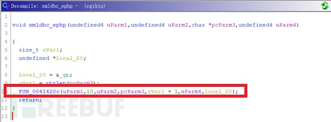

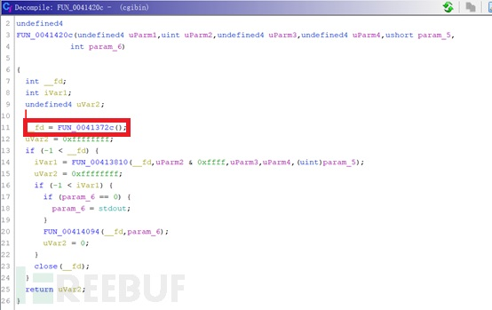

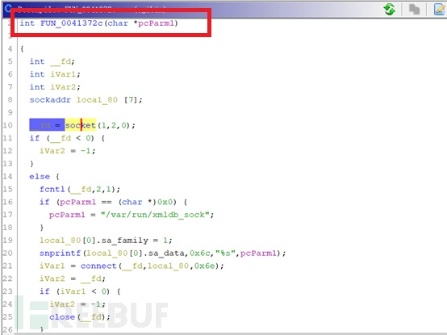

* 关于run.NOTIFY.php内容，其中可见调用了PHP函数 `GENA_subscribe_new()`，并传递变量`SHELL_FILE`。搜索`GENA_subscribe_new()`发现其定义在gena.php文件中，分析`GENA_subscribe_new()`功能可知其并不修改`$shell_file`变量

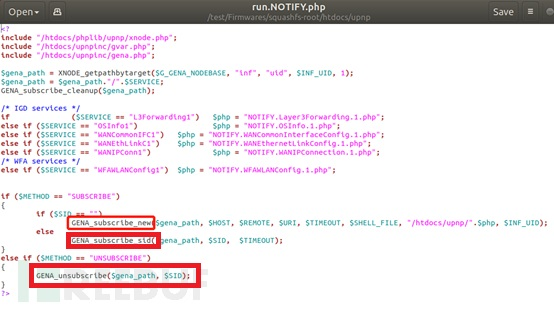

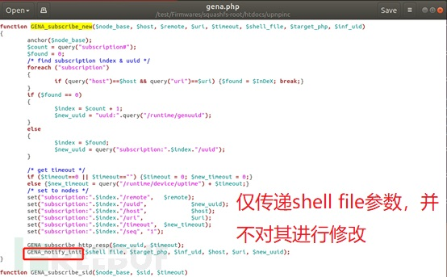

* 其传递 `$shell_file`到`GENA_notify_init()`函数，也就是shell_file最终处理的地方：通过调用PHP函数`fwrite()`创建新文件，且`fwrite()`函数被使用了两次：

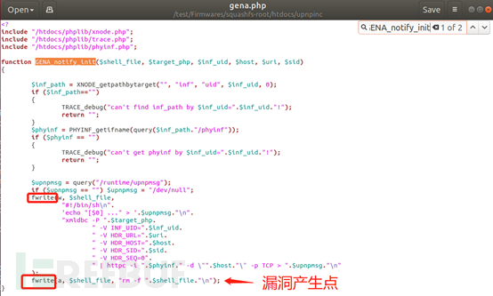

* `fwrite()`函数第一次创建文件，文件名由可控的SHELL_FILE变量(uri_service)以及getpid()组成：

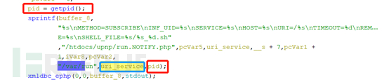

* 第二次调用fwrite()向文件中添加删除命令”`rm -f”.$shell_file.”\n`”，攻击时，只需要插入一个反引号包裹的系统命令，将其注入到shell脚本中，当脚本执行rm命令时遇到反引号将失败，继续执行引号里面的系统命令，从而达到远程命令执行漏洞的触发。因此，控制好`/gena.cgi\n service=shell_file`中`shell file`的内容为反引号包裹的系统命令，就可以触发漏洞。

## 参考资料

[IoT 设备网络协议模糊测试工具boofuzz实战](https://blog.csdn.net/song_lee/article/details/104334096)