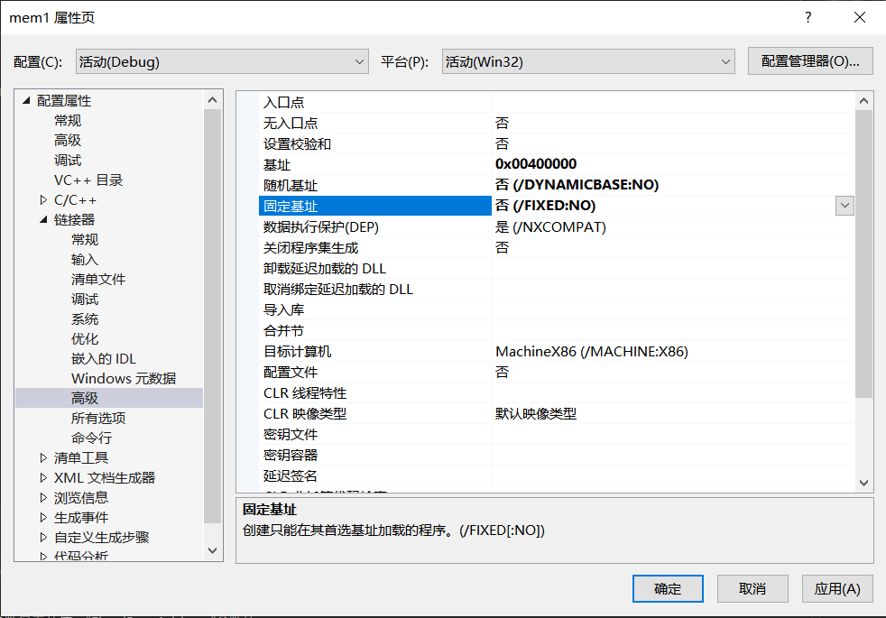
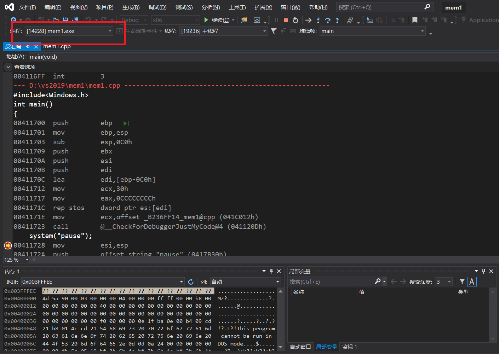
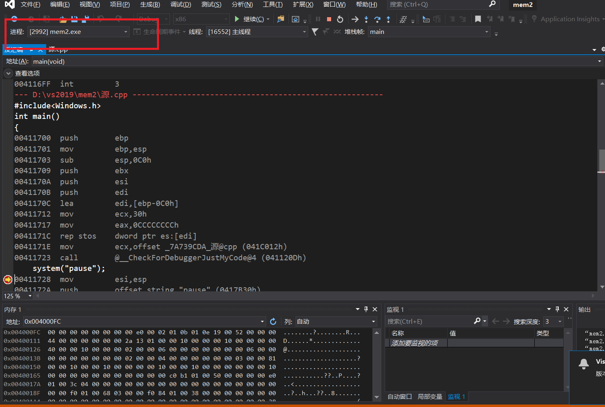
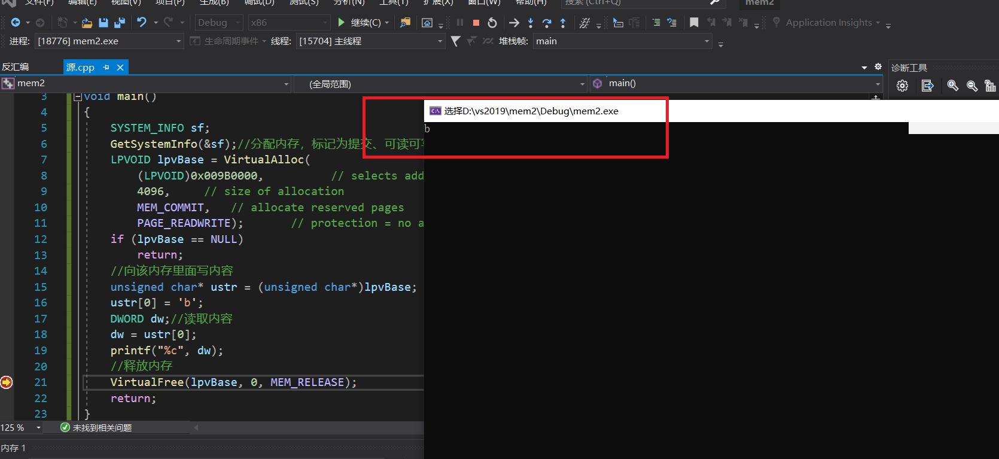
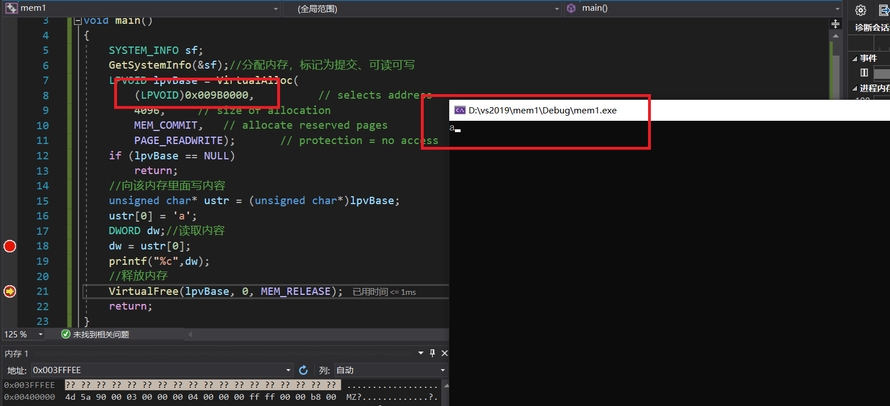
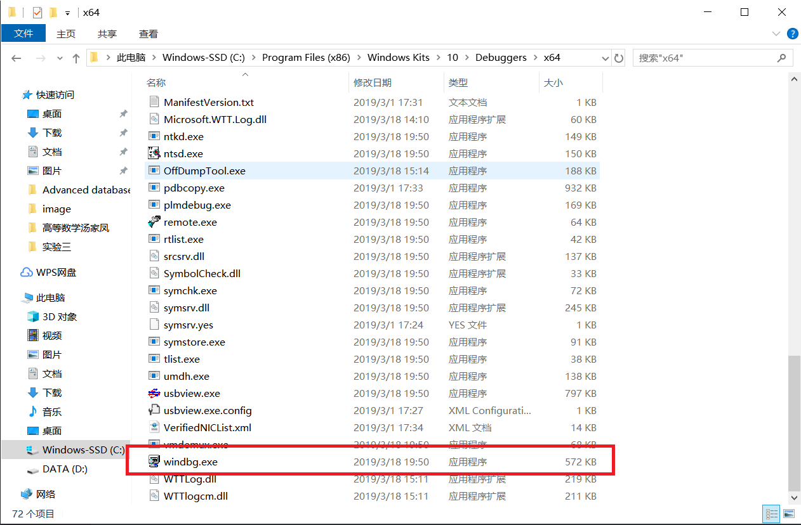
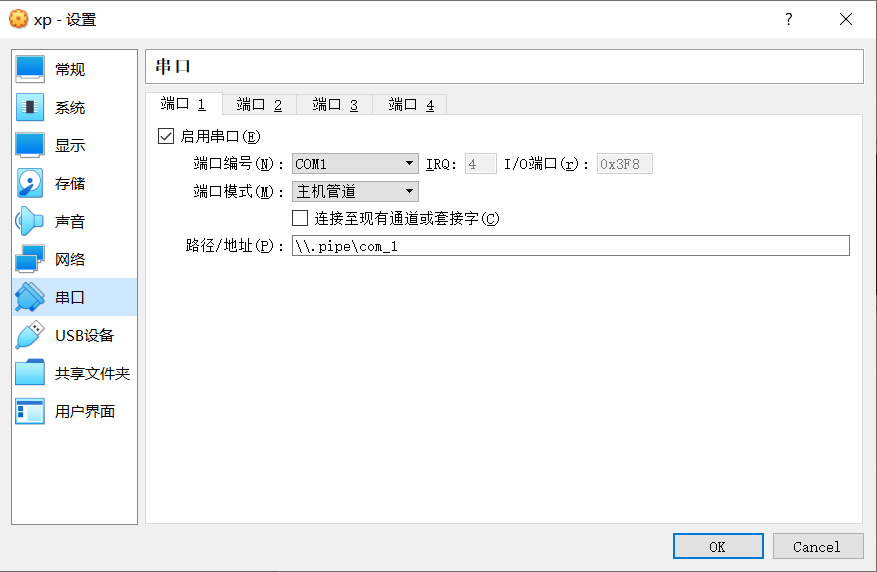
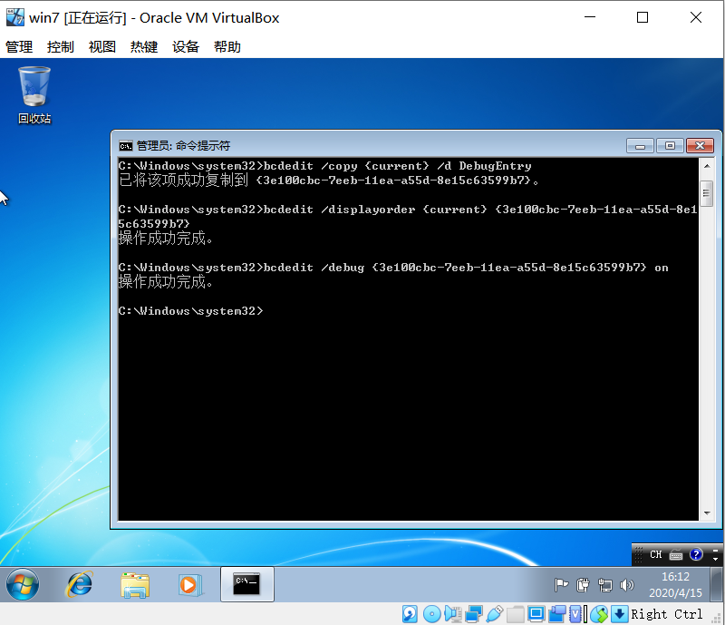
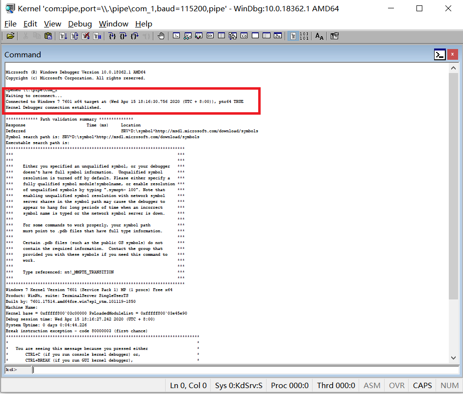
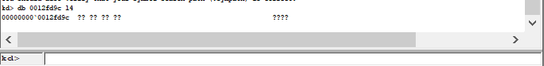

# 作业

## 一、vs

> 1、验证不同进程的相同的地址可以保存不同的数据。（1）在VS中，设置固定基地址，编写两个不同可执行文件。同时运行这两个文件。然后使用调试器附加到两个程序的进程，查看内存，看两个程序是否使用了相同的内存地址；（2）在不同的进程中，尝试使用VirtualAlloc分配一块相同地址的内存，写入不同的数据。再读出。

* 设置两个程序的固定基地址均为0x00400000



* 生成两个.exe文件

```c++
#include<Windows.h>
int main()
{
    system("pause");
}
```

* 同时运行,使用调试器附加到两个程序的进程并查看内存，如图，确实使用了相同的内存地址





* 在不同的进程中，尝试使用VirtualAlloc函数分配一块相同地址的内存，写入不同的数据。再读出。

```c++
#include <windows.h>
#include<stdio.h>
void main()
{
    SYSTEM_INFO sf;
    GetSystemInfo(&sf);//分配内存，标记为提交、可读可写 
    LPVOID lpvBase = VirtualAlloc(
        (LPVOID)0x009B0000,          // selects address        
        4096,     // size of allocation        
        MEM_COMMIT,   // allocate reserved pages        
        PAGE_READWRITE);       // protection = no access   
    if (lpvBase == NULL)
        return;
    //向该内存里面写内容
    unsigned char* ustr = (unsigned char*)lpvBase;
    ustr[0] = 'a';
    DWORD dw;//读取内容
    dw = ustr[0]; 
    printf("%c",dw);
    //释放内存
    VirtualFree(lpvBase, 0, MEM_RELEASE);
    return;
}

```

* 分别设置断点，使进程二在内存中写入内容后进程一再读取内容。如图，分别读出b和a。验证了不同进程的相同的地址可以保存不同的数据。





## 二、windbg

> 2、（难度较高）配置一个Windbg双机内核调试环境，查阅Windbg的文档，了解（1）Windbg如何在内核调试情况下看物理内存，也就是通过物理地址访问内存（2）如何查看进程的虚拟内存分页表，在分页表中找到物理内存和虚拟内存的对应关系。然后通过Windbg的物理内存查看方式和虚拟内存的查看方式，看同一块物理内存中的数据情况。

* 在主机上安装windbg



* 关闭虚拟机的防火墙
* 设置xp虚拟机，设置与Windbg连接的管道串口



* 修改guest端配置

```
bcdedit /dbgsettings serial baudrate:115200 debugport:1
bcdedit /copy {current} /d DebugEntry
bcdedit /displayorder {current} {替换第二个命令显示的UUID}
bcdedit /debug {替换第二个命令显示的UUID} on
```



* 对host端进行配置*（由于符号表不能下载下来，可能是被墙掉了，windbg中命令部分执行结果不能正确显示符号）*

```c
"C:\Program Files (x86)\Windows Kits\10\Debuggers\x64\windbg.exe" -y SRV*D:\symbol*http://msdl.microsoft.com/download/symbols -b -k com:pipe,port=\\.\pipe\com_1,baud=115200,pipe//启动windbg并配置windbg的符号下载地址
```

* 成功连接



* Windbg的物理内存查看方式查看物理内存

```
!db [Caching] [-m] [PhysicalAddress] [L Size] 
!dc [Caching] [-m] [PhysicalAddress] [L Size] 
!dd [Caching] [-m] [PhysicalAddress] [L Size] 
!dp [Caching] [-m] [PhysicalAddress] [L Size] 
!dq [Caching] [-m] [PhysicalAddress] [L Size] 
!du [Caching] [-m] [PhysicalAddress] [L Size] 
!dw [Caching] [-m] [PhysicalAddress] [L Size] 
```



* Windbg的虚拟内存的查看方式查看物理内存

```cmake
#显示EPROCESS 块扩展显示信息。
kd> !process 0 0
**** NT ACTIVE PROCESS DUMP ****
....
PROCESS ff779190  SessionId: 0  Cid: 04fc    Peb: 7ffdf000  ParentCid: 0394
 DirBase: 098fd000  ObjectTable: e1646b30  TableSize:   8.
    Image: MyApp.exe
#！Vtop扩展将虚拟地址转换为相应的物理地址，并显示其他页表和页目录信息。此处由于目录基本 0x098FD000，其 PFN 是 0x098FD
!vtop PFN VirtualAddress 
!vtop 0 VirtualAddress 
kd> !vtop 98fd 12f980
Pdi 0 Pti 12f
0012f980 09de9000 pfn(09de9)
#此处物理地址为09de9000+980=0x09DE9980
#然后再查看物理内存即可
db 0x09DE9980 l4
```

## 参考资料

[使用 Visual Studio 调试器附加到运行的进程](https://docs.microsoft.com/zh-cn/visualstudio/debugger/attach-to-running-processes-with-the-visual-studio-debugger?view=vs-2019)

[Windbg+VirtualBox双机调试环境配置(XP/Win7/Win10)](https://www.cnblogs.com/aliflycoris/p/5877323.html)

[Windows 内核调试](https://zhuanlan.zhihu.com/p/47771088)

[按物理地址访问内存](https://docs.microsoft.com/zh-cn/windows-hardware/drivers/debugger/accessing-memory-by-physical-address)

[按虚拟地址访问内存](https://docs.microsoft.com/zh-cn/windows-hardware/drivers/debugger/accessing-memory-by-virtual-address)

[windbg虚拟地址转换为内存地址](https://blog.csdn.net/shuishan_lmy/article/details/72897858)