## Web漏洞演示

* 运行代码httpserver.py（使用python原生的cgi和http.server两个库运行的一个简单的http服务器程序），然后在浏览器中访问 http://127.0.0.1:8080/a.html

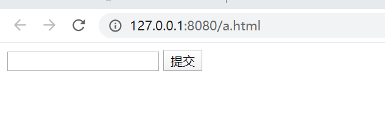

* chrome在菜单-更多工具，开发者工具里面，到sources这个tab就看到了服务器向浏览器返回的数据，就是我们的form_html变量

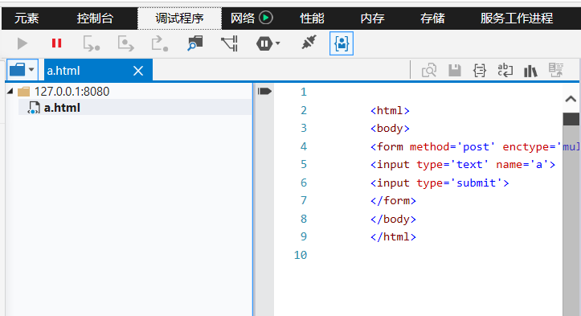

* 下面再访问一个不存在的页面，比如b.html，又会出现那个默认的form。如果这时我们输入

```
<html><body><script>alert('XSS')</script></form></body></html>
```

然后在访问b.html的时候，整个页面被载入 script在浏览器上执行

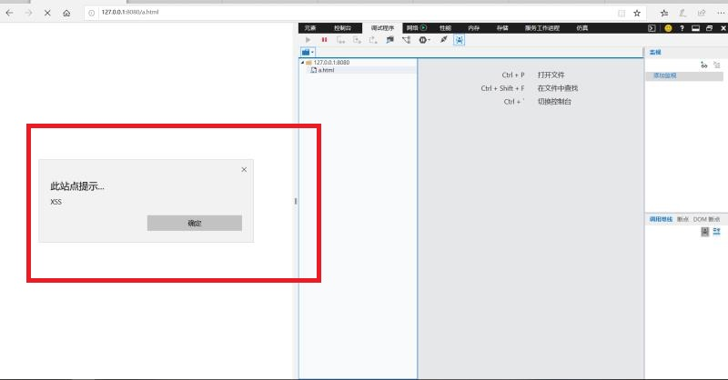

* 在浏览器中访问http://127.0.0.1:8080/httpserver.py由于服务器没有做任何过滤，只要是存在的文件，就发送给客户端，源代码文件也发送给了客户端。现在黑客可以知道我整个后台的逻辑了。

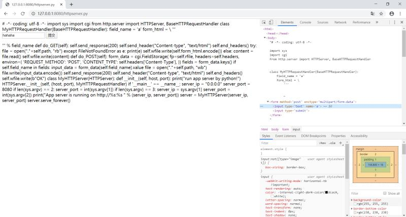

* 到调试工具的 elements，由于后台只处理名为a的表单项，把input的name改为a，httpserver.py发生变化

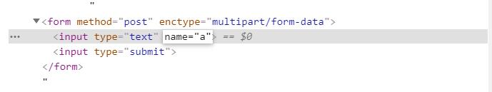

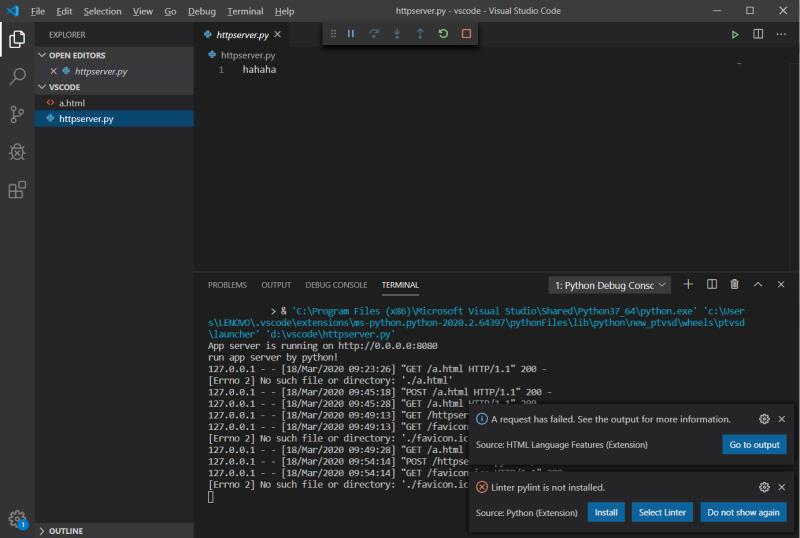

---

>使用Django这种框架编程，第一步是定义模型，Django会自动把定义好的模型转化为数据库表结构。这种方式称为 ORM。views是Django功能实现应用功能的地方。如果你想写一个动态的页面，就在views中定义一个函数。最基本的views函数，是收到一个HttpRequest类型的参数，需要返回一个HTTPResponse类型的返回值。

* 在edu_admin中的views.py写入以下内容

```python
from django.http import HttpResponse
def index(request):
    return HttpResponse('<html><body>OK</body></html>')#这个函数就是一个基本的 “处理请求，返回响应”
```

* 在edu_admin中建一个urls.py文件，写入如下内容

```python
from django.urls import path
from .views import *
urlpatterns=[
    path('index',index),
]
```

* 在主urls.py，也就是 mysite的urls.py中包括这个url配置，这是为了适应，可能有多个Django app共同工作的情况。

```python
from django.contrib import admin
from django.urls import path，include

urlpatterns = [
    path('edu/',include('edu_admin.urls')),
    path('admin/', admin.site.urls),
]
```

* 运行程序，访问127.0.0.1:8000

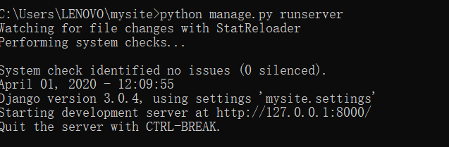

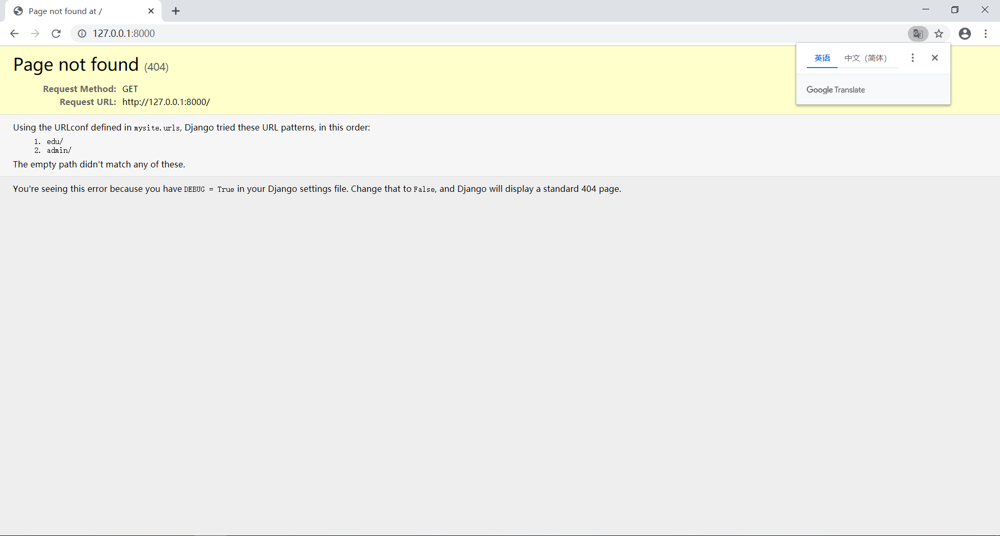

* 访问 http://127.0.0.1:8000/edu/index，如果这一步有，就说明我们 urls和views配合工作成功。用户在浏览器中输入路径，django把这个url对应到一个views函数上。views函数处理HttpRequest。返回HttpResponse。


* 修改view.py，在 models.py中导入，然后继承修改之。

```python
from django.shortcuts import render
from django.contrib.auth.decorators import login_required
from django.http import HttpResponse

from .models import Score#先从models中导入模型类。

def index(request, pk):
    return HttpResponse('<html><body>hello world %d </body></html>' % pk)

# Create your views here.

@login_required
def my_score(request):
    result = Score.objects.filter(student=request.user)
    #然后调用这个模型类的objects的filter方法，就完成了一次sql select，filter函数的参数是就相当于查询的过滤条件。我们要查询的是 student为当前登录用户的Score表的记录
    return render(request, 'score.html', {'result': result})
```

```python
class Student(AbstractUser):
    class_name = models.CharField(verbose_name="班级", max_length=100, blank=True,null=True)
    name=models.CharField(verbose_name="姓名",max_length=100,blank=True,null=True)
    number=models.IntegerField(verbose_name="学号",default=0)
    phone_number = models.CharField(verbose_name='手机号', max_length=11,null=True)
```

* 在mysite settings.py也就是整个站点的配置文件中，增加一条`AUTH_USER_MODEL = 'edu_admin.Student'`，告诉Django，使用 edu_admin 的Student作为用户管理登录授权的模型。
* 重新进行migrate

```
python manage.py makemigrations 
python manage.py migrate
```

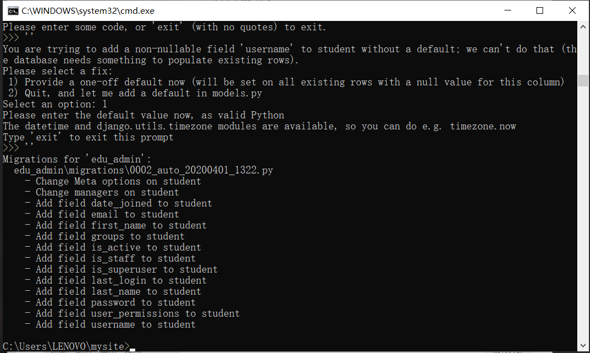

* 用Django的方式，先建立一个超级用户，`python manage.py createsuperuser`，建立一个管理员账户。可以直接操作数据库
* 在admin.py中录入以下内容。这样直接就可以生成一个管理数据库的后台页面。访问 http://127.0.0.1:8000/admin/ 刚才新建的用户 登录后看到这个页面。可以录入一些课程，学生，和成绩了。

```python
from django.contrib import admin

# Register your models here.
from .models import Student, Course, Score

class ScoreAdmin ( admin.ModelAdmin ):
    list_display = ('course', 'score', 'student')

admin.site.register(Student)
admin.site.register(Course)
admin.site.register(Score, ScoreAdmin)

```

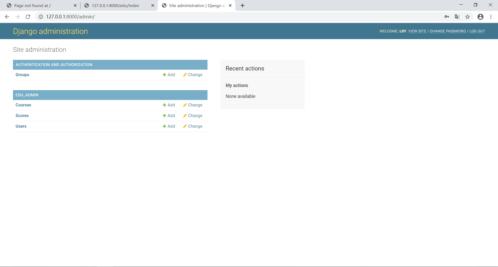

* 为了在admin管理的时候，直接显示课程名称，可以给course模型增加一个 __str__方法。

```python
class Course(models.Model):
    name = models.CharField(verbose_name='课程名',  max_length=100)
    number = models.IntegerField(verbose_name='编号', default=0)
    summary = models.CharField(verbose_name='摘要', max_length=500, null=True)
    def __str__(self):
        return self.name
```

* 在数据库用sql也可以查询到

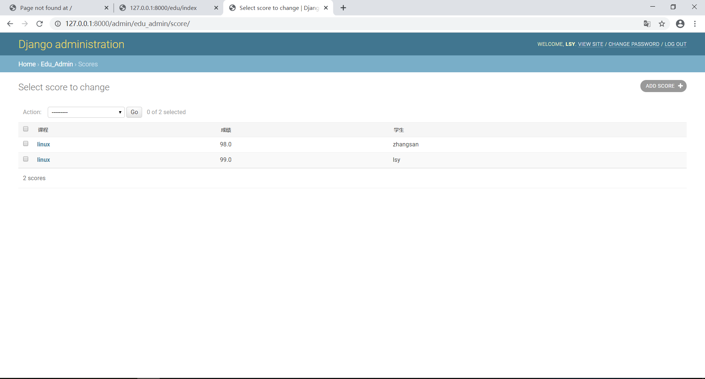

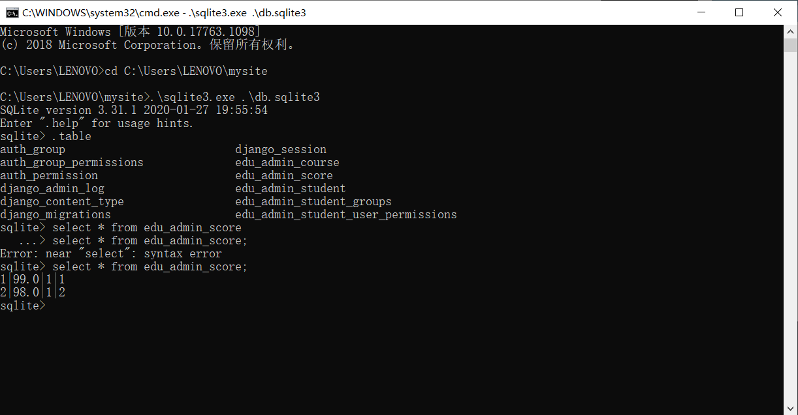

* 新建templates目录，新建score.html

```html
<html>
<body>

科目： {{ i.course.name }}
成绩： {{ i.score }}
<br>

</body>
</html>
```

* 写了新的views函数，需要增加url

```python
from django.urls import path
from .views import *
urlpatterns=[
    path('index',index),
    path('myscore',my_score),
]
```

* 即可在页面中查看到科目与成绩（注：只显示当前登陆学生的信息）


## sql注入漏洞

* 下载Django并访问

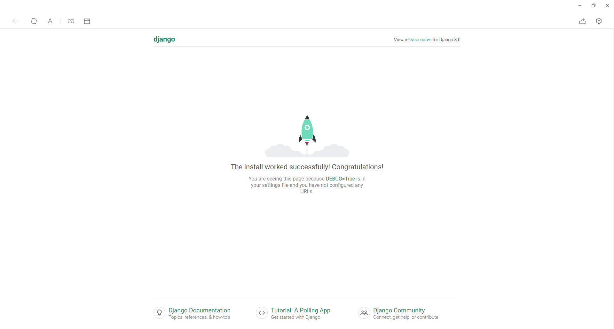

* 新建一个app

```python
python manage.py startapp edu_admin
```

* 然后用vscode打开工程，然后对edu_admin的models.py文件进行替换
* 之前startapp命令只是创建了app，必须要把app写入到这里，这个app才会被纳入到站点功能中。
* 输入如下命令

```
python .\manage.py makemigrations
python .\manage.py migrate
```

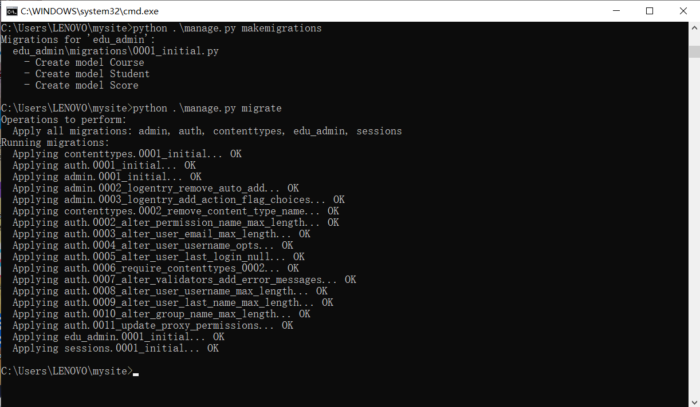

* 然后在mysite目录下执行

```
sqlite3.exe db.sqlite3
```

可以看到数据库内容

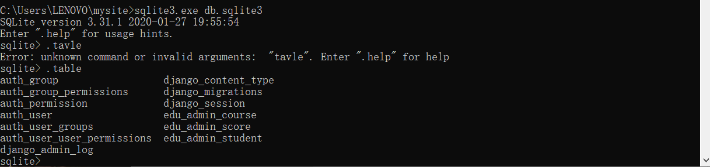

